[011 \- Gravy Jobs（★6）](https://atcoder.jp/contests/typical90/tasks/typical90_k)

# アルゴリズム

## 問題

```mermaid
gantt
    title Jobs
    tickInterval 1second
    dateFormat X
    axisFormat %s
    section Job 1
    200000   : 1, 4
    Deadline : milestone, m1, 8, 8
    section Job 2
    100000   : 1, 3
    Deadline : milestone, m1, 4, 4
    section Job 3
    150000   : 1, 4
    Deadline : milestone, m1, 6, 6
```


締め切りが設定された仕事があります。適切な順に実行します。

```mermaid
gantt
    title Jobs
    tickInterval 1second
    dateFormat X
    axisFormat %s
    section Job 1
    200000   : 4, 7
    Deadline : milestone, m1, 8, 8
    section Job 2
    100000   : done, 1, 3
    Deadline : milestone, m1, 4, 4
    section Job 3
    150000   : 1, 4
    Deadline : milestone, m1, 6, 6
```



この問題では Job 2 を捨てて Job 3, Job 1 の順に行うと 200000 + 150000 円が得られます。


## 締め切り昇順にソートして DP

問題の順番のままだと、手前に割り込んで実行することを考えることになり、空き時間の管理が難しいです。

仕事を締め切り順にソートすると、手前に割り込んで実行することは考えなくて良くなります。最後にその仕事を行うかどうかという DP を解けば終了です。

```mermaid
gantt
    title Jobs
    tickInterval 1second
    dateFormat X
    axisFormat %s
    section Job 2
    100000   : done, 1, 3
    Deadline : milestone, m1, 4, 4
    section Job 3
    150000   : 1, 4
    Deadline : milestone, m1, 6, 6
    section Job 1
    200000   : 4, 7
    Deadline : milestone, m1, 8, 8
```



||0|1|2|3|4|5|6|7|
|---|---|---|---|---|---|---|---|---|
||0|0|0|0|0|0|0|0|0|
|Job 2 まで考える|0|0|✅100000|100000|||||
|Job 1 まで考える|0|0|100000|✅150000|150000|✅250000|||
|Job 3 まで考える|0|0|100000|✅200000|200000|250000|✅350000|350000|

タプルの配列 `dcs = Vec<(usize, usize, usize)>` のソートは、そのまま `dcs.sort();` で行えます。タプルの先頭キーを優先し、先頭キーが同じなら次のキーを見ます。

```rust
input! {
    n: usize,
    mut dcs: [(usize, usize, usize); n],
}
dcs.sort();
```

この DP です。

```rust
const D: usize = 5000;
let mut dp = vec![vec![0usize; D + 1]; n + 1];
dp[0][0] = 0;

for (i, &(d, c, s)) in dcs.iter().enumerate() {
    for j in 0..=D {
        dp[i + 1][j] = dp[i + 1][j].max(dp[i][j]);
        let j0 = j + c;
        if j0 <= d {
            dp[i + 1][j0] = dp[i + 1][j0].max(dp[i][j] + s);
        }
    }
}
```

## DP の履歴数を減らす

前の DP の辿り方では、1つ手前の結果しか見ていません。仕事の数だけ配列を用意しても見直さないというのは、少し勿体ないです。

1つ前のだけ配列 `v` で覚えるように書くこともできます。メモリを節約できます。

```rust
let mut v = vec![0usize; D + 1];
v[0] = 0;

for &(d, c, s) in &dcs {
    let prev = v.clone();
    for i in c..=d {
        v[i] = v[i].max(prev[i - c] + s);
    }
}
```

しかし競技プログラミングでは、空間計算量はそんなに重視しなくて良いと思います。


## 締め切り降順にソートして DP

締め切り降順にソートして、後の方の仕事から埋めていく方法でも良いです。「5日目に Job 3 に着手できれば追加で 2000000円得られる」のように。途中に割り込みがないという意味では同じです。

```mermaid
gantt
    title Jobs
    tickInterval 1second
    dateFormat X
    axisFormat %s
    section Job 1
    200000   : 4, 7
    Deadline : milestone, m1, 8, 8
    section Job 3
    150000   : 1, 4
    Deadline : milestone, m1, 6, 6
    section Job 2
    100000   : done, 1, 3
    Deadline : milestone, m1, 4, 4
```



||0|1|2|3|4|5|6|7|
|---|---|---|---|---|---|---|---|---|
||0|0|0|0|0|0|0|0|0|
|Job 3 まで考える|✅200000|✅200000|✅200000|✅200000|✅200000|200000|0|0|
|Job 1 まで考える|✅350000|✅350000|200000|200000|200000|200000|0|0|
|Job 2 まで考える|350000|350000|200000|200000|200000|200000|0|0|

最後まで仕事を調べ終えた後の左端の値が、期待できる金額となります。

# 実装例

## 締め切り昇順にソートして DP
https://github.com/hossy3/atcoder-solutions/blob/main/atcoder/typical90/src/bin/011_dp.rs

## DP の履歴数を減らす
https://github.com/hossy3/atcoder-solutions/blob/main/atcoder/typical90/src/bin/011_dp_compact.rs

## 締め切り降順にソートして DP
https://github.com/hossy3/atcoder-solutions/blob/main/atcoder/typical90/src/bin/011_dp_compact_rev.rs
