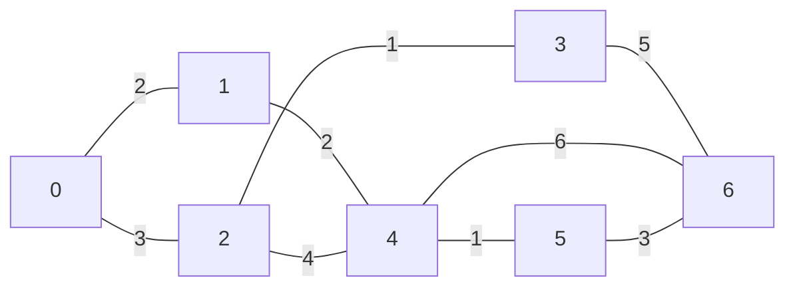

[013 \- Passing（★5）](https://atcoder.jp/contests/typical90/tasks/typical90_m)

# アルゴリズム

## 方針

[003 - Longest Circular Road（★4）](./typical90_003) の全ノード版です。

「街 1 から街 k を経由して街 N まで移動するときにかかる時間の最小値」は、「街 1 から街 k まで移動するときにかかる時間の最小値」と「街 N から街 k まで移動するときにかかる時間の最小値」の合計で求まります。「街 N から街 k まで」 と 「街 k から街 N まで」にかかる時間は同じです。



||街0→街i|街N→街i|街0→街i→街N|
|---|---|---|---|
|街0|0|8|8|
|街1|2|6|8|
|街2|3|6|9|
|街3|4|5|9|
|街4|4|4|8|
|街5|5|3|8|
|街6|8|0|8|

「移動にかかる時間が一定でない」というのを、「辺に重みがある」と読み替えて考えます。


## 重みあり無向グラフを組み立てる

003 重みなし版と同じように組み立てられます

```rust
// 重みなし
fn build_ungraph(n: usize, uv: &[(usize, usize)]) -> Vec<Vec<usize>> {
    let mut graph = vec![vec![]; n]; // node, edge
    for &(u, v) in uv {
        graph[u].push(v);
        graph[v].push(u);
    }
    graph
}

// 重みあり
fn build_ungraph_with_cost(n: usize, uvc: &[(usize, usize, usize)]) -> Vec<Vec<(usize, usize)>> {
    let mut graph = vec![vec![]; n]; // node, (edge, cost)
    for &(u, v, c) in uvc {
        graph[u].push((v, c));
        graph[v].push((u, c));
    }
    graph
}
```

## dijkstra

辺に重みがあるときは、重み付きキュー `BinaryHeap` で組み立てます。 両端キュー `VecDeque` は重みがあるときには使えません。

```rust
fn shortest_all_ungraph_with_cost(s: usize, graph: &[Vec<(usize, usize)>]) -> Vec<Option<usize>> {
    let n = graph.len();
    let mut v = vec![None; n];
    let mut heap = BinaryHeap::<(Reverse<usize>, usize)>::new();
    v[s] = Some(0usize);
    heap.push((Reverse(0), s));

    while let Some((Reverse(c), i)) = heap.pop() {
        if let Some(c0) = v[i] {
            if c0 < c {
                continue;
            }
        }
        for &(i0, c0) in &graph[i] {
            let c0 = c + c0;
            if let Some(c1) = v[i0] {
                if c1 <= c0 {
                    continue;
                }
            }
            v[i0] = Some(c0);
            heap.push((Reverse(c0), i0));
        }
    }
    v
}
```

到達可能 `Some()` と到達不能 `None` を区別できるように、 `Option<usize>` を返すようにしています。この問題でも 003 同様に「どの街の間も、いくつかの道路を通って移動可能」 ですので `usize` をそのまま返せば十分です。ほかの問題でもそのまま使いまわせるように、という理由です。

すべての街についての時間を求められました。街 `i` を通る時間の最小値は次のように出力できます。

```rust
let s0 = shortest_all_ungraph_with_cost(0, &graph);
let sn = shortest_all_ungraph_with_cost(n - 1, &graph);

for i in 0..n {
    let result = s0[i].unwrap() + sn[i].unwrap();
    println!("{result}");
}
```


## dijkstra (pathfinding)

* [dijkstra\_all in pathfinding::directed::dijkstra \- Rust](https://docs.rs/pathfinding/latest/pathfinding/directed/dijkstra/fn.dijkstra_all.html)

003 と同じ `dijkstra_all()` を使います。 (到達可能なノード, (親ノード, コスト)) という対応の `HashMap` が返ります。

街0 から街0 への移動はこの結果には含まれません。親ノードがありませんので。そのため Hash から値を取り出しつつ、「パスが見つからない場合はコスト 0 とみなす」ようなコードを追加します。

```rust
let reachable0 = dijkstra_all(&0, |&i| graph[i].iter().copied());
let reachable1 = dijkstra_all(&(n - 1), |&i| graph[i].iter().copied());

for i in 0..n {
    let c0 = reachable0.get(&i).and_then(|&(_, c)| Some(c)).unwrap_or(0);
    let c1 = reachable1.get(&i).and_then(|&(_, c)| Some(c)).unwrap_or(0);
    let result = c0 + c1;
    println!("{result}");
}
```

# 実装例

## dijkstra
https://github.com/hossy3/atcoder-solutions/blob/main/atcoder/typical90/src/bin/013_dijkstra.rs

## dijkstra (pathfinding)
https://github.com/hossy3/atcoder-solutions/blob/main/atcoder/typical90/src/bin/013_pathfinding.rs
