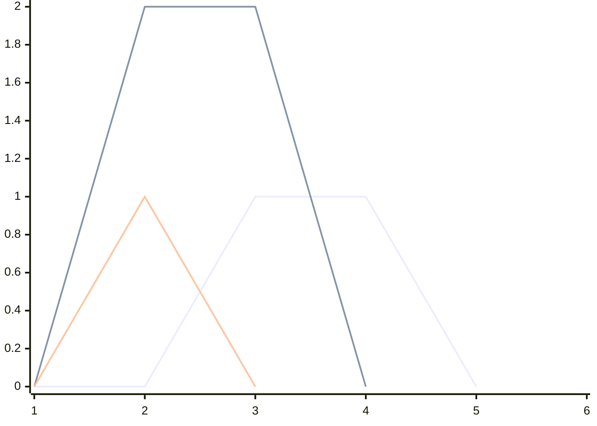

[017 \- Crossing Segments（★7）](https://atcoder.jp/contests/typical90/tasks/typical90_q)

# アルゴリズム

## 方針

円周を6分割し、 (2, 5), (1, 4), (1, 3) の 3つの組に対する線分を引いた時の交点数を考えます。円周の端を切って広げると、次のグラフのようになります。 [^1]



[^1]: [XY Chart \| Mermaid](https://mermaid.js.org/syntax/xyChart.html) `xychart-beta` を使って描いています。将来表示できなくなるかもしれません。その際には再調整します。)

このように広げても、交点が 2か所あることが分かります。

交点があるかどうかは、(2, 5) などを区間と考えると、「区間を追加するたびに、始点の有向区間数がいくつあるか」で求まります。

区間を、`r` 昇順、`r` が同じときは `l` 降順となるように、事前に並び替えて、次のように考えます。

||1|2|3|4|5|6|追加交点数|
|---|---|---|---|---|---|---|---|
|(1, 3) 検査|🔍0|0|0|0|0|0|🔍0|
|(1, 3) 追加|0|⚡1|0|0|0|0||
|(1, 4) 検査|🔍0|1|0|0|0|0|🔍0|
|(1, 4) 追加|0|⚡2|⚡1|0|0|0||
|(2, 5) 検査|0|🔍2|1|0|0|0|🔍2|
|(2, 5) 追加|0|2|⚡2|⚡1|0|0||

「区間すべての値に1を追加する」「一点の値を取得する」構造を使えば、このようにして問題を解けます。

## 降順に並び替え

> 区間を、`r` 昇順、`r` が同じときは `l` 降順となるように、事前に並び替えて、

は、このように実装します。

```rust
let mut lr: Vec<(usize, usize)> = // ...
lr.sort_by_key(|&(l, r)| (r, Reverse(l)));
```

非負整数型と整数型をあまり区別しない言語ならタプルを `(r, -l)` と書けば良いところです。Rust では `usize` に負数を入れると panic します。

`Reverse` 型を持ち出さなくても、`(r, l.wrapping_neg())` でも良いはずです。


## 遅延セグメント木

区間に対して操作できる遅延セグメント木が、シンプルなな解き方だと思います。たとえば「区間すべての値に指定した値を追加する」「区間の最大値を取得する」構造 `MaxAdd` を使います。 ac-library-rs のサンプルコードにあります。

```rust
struct MaxAdd;
impl MapMonoid for MaxAdd {
    type M = Max<i64>;
    type F = i64;

    fn identity_map() -> Self::F {
        0
    }
    fn mapping(&f: &Self::F, &x: &<Self::M as Monoid>::S) -> <Self::M as Monoid>::S {
        f + x
    }
    fn composition(&f: &Self::F, &g: &Self::F) -> Self::F {
        f + g
    }
}
```

```rust
let mut result = 0;
let mut segtree: LazySegtree<MaxAdd> = vec![0i64; n].into();
for &(l, r) in &lr {
    result += segtree.get(l);
    segtree.apply_range((l + 1)..r, 1);
}
```

「区間の最大値を取得する」部分は、一点取得しかしない今回の使い方ではなんでも良いです。「区間和を取得する」でも良いです。

## セグメント木

先ほどは区間を更新する形をとりました。

||1|2|3|4|5|6|追加交点数|
|---|---|---|---|---|---|---|---|
|(1, 3) 検査|🔍0|0|0|0|0|0|🔍0|
|(1, 3) 追加|0|⚡1|0|0|0|0||
|(1, 4) 検査|🔍0|1|0|0|0|0|🔍0|
|(1, 4) 追加|0|⚡2|⚡1|0|0|0||
|(2, 5) 検査|0|🔍2|1|0|0|0|🔍2|
|(2, 5) 追加|0|2|⚡2|⚡1|0|0||

始点を +1, 終点を -1 して、検査するときに累積和を取る形でも良いです。遅延セグメント木よりもシンプルな、セグメント木で扱えるようになります。

||1|2|3|4|5|6|追加交点数|
|---|---|---|---|---|---|---|---|
|(1, 3) 検査|🔍0|0|0|0|0|0|🔍0|
|(1, 3) 追加|0|⚡1|⚡-1|0|0|0||
|(1, 4) 検査|🔍0|1|-1|0|0|0|🔍0|
|(1, 4) 追加|0|⚡2|-1|⚡-1|0|0||
|(2, 5) 検査|🔍0|🔍2|-1|-1|0|0|🔍2|
|(2, 5) 追加|0|2|⚡0|-1|⚡-1|0||

```rust
let mut result = 0;
let mut segtree = Segtree::<Additive<i64>>::new(n);
for &(l, r) in &lr {
    result += segtree.prod(..=l);
    segtree.set(l + 1, segtree.get(l + 1) + 1);
    segtree.set(r, segtree.get(r) - 1);
}
```

`Additive` は ac-library-rs にあります。セグメント木の内部のことは分からなくても利用できます。

## フェニック木

区間和向けのデータ構造のフェニック木も使えます。

```rust
let mut result = 0;
let mut tree = FenwickTree::new(n, 0i64);
for &(l, r) in &lr {
    result += tree.sum(..=l);
    tree.add(l + 1, 1);
    tree.add(r, -1);
}
```

## データ構造の比較

|設定|フェニック木|セグメント木|遅延セグメント木|
|---|---|---|---|
|要素の単位元|不要 (常に 0)|✅ 必要|✅ 必要|
|要素の計算 binary_operation|不要 (常に和)|✅ 必要|✅ 必要|
|要素の更新方法|一点加算|一点|区間|
|遅延成分の単位元|なし|なし|✅ 必要|
|遅延成分を要素に適用 mapping|なし|なし|✅ 必要|
|遅延成分同士の合成 composition|なし|なし|✅ 必要|


# Tips

## 単体テスト

```rust
result += segtree.get(l);
segtree.apply_range((l + 1)..r, 1);
```

どの方針でも実装はとても短いですが、`get()` と範囲更新で両端を含むかどうかで混乱しそうです。

このようなときは、エッジケースに対する単体テストをたくさん書きます。そうすると安心できます。

```rust
#[test]
fn test_name() {
    // 交差
    assert_eq!(f(4, &vec![(1, 3), (2, 4)]), 1);
    assert_eq!(f(4, &vec![(2, 4), (1, 3)]), 1);

    // 離れている
    assert_eq!(f(4, &vec![(1, 2), (3, 4)]), 0);
    assert_eq!(f(4, &vec![(3, 4), (1, 2)]), 0);
    assert_eq!(f(4, &vec![(1, 2), (3, 4)]), 0);
    assert_eq!(f(4, &vec![(3, 4), (1, 2)]), 0);

    // 一点接触
    assert_eq!(f(3, &vec![(1, 2), (1, 3)]), 0);
    assert_eq!(f(3, &vec![(1, 3), (1, 2)]), 0);
    assert_eq!(f(3, &vec![(1, 3), (2, 3)]), 0);
    assert_eq!(f(3, &vec![(2, 3), (1, 3)]), 0);

    // 実例
    assert_eq!(f(6, &vec![(2, 5), (1, 4), (1, 3)]), 2);
}
```

入力例が `vec![(2, 5), (1, 4), (1, 3)])` 問題と揃えて書きやすいように、この問題については標準入力を受ける時点では `Usize1` せず、問題を解くときに組み立て直しています。

```rust
fn f(n: usize, lr: &[(usize, usize)]) -> i64 {
    let mut lr: Vec<(usize, usize)> = lr.iter().map(|&(l, r)| (l - 1, r - 1)).collect();
```


# 実装例

## 遅延セグメント木
https://github.com/hossy3/atcoder-solutions/blob/main/atcoder/typical90/src/bin/017_lazysegtree.rs

## セグメント木
https://github.com/hossy3/atcoder-solutions/blob/main/atcoder/typical90/src/bin/017_segtree.rs

## フェニック木
https://github.com/hossy3/atcoder-solutions/blob/main/atcoder/typical90/src/bin/017_fenwicktree.rs
