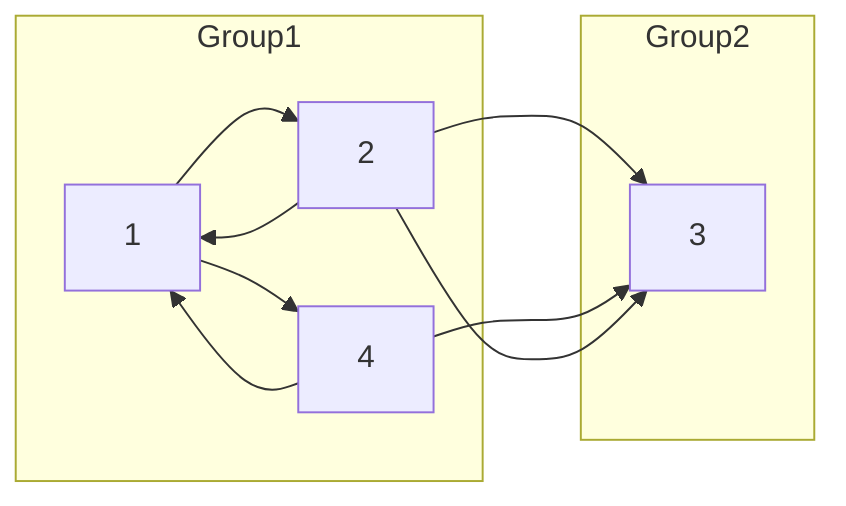

[021 \- Come Back in One Piece（★5）](https://atcoder.jp/contests/typical90/tasks/typical90_u)


# アルゴリズム

## 強連結成分 SCC



強連結成分 Group1 の間は、有向グラフ内を自由に行き来できます。

この問題の答えは `(1, 2)`, `(1, 4)`, `(2, 4)` の 3通りです。数え上げは Group1 の要素数 3 から 3 * (3 - 1) / 2 で行えます。

* [SccGraph in ac\_library::scc \- Rust](https://docs.rs/ac-library-rs/0.1.1/ac_library/scc/struct.SccGraph.html)
* [strongly\_connected\_components in pathfinding::directed::strongly\_connected\_components \- Rust](https://docs.rs/pathfinding/latest/pathfinding/directed/strongly_connected_components/fn.strongly_connected_components.html)

強連結成分の組み立ては `ac_library::SccGraph` や `pathfinding::directed::strongly_connected_components` にお任せできます。

```rust
let mut graph = SccGraph::new(n);
for (a, b) in ab {
    graph.add_edge(a, b);
}
let scc = graph.scc();
```

# 実装例

## ac_library::SccGraph
https://github.com/hossy3/atcoder-solutions/blob/main/atcoder/typical90/src/bin/021_scc.rs

## pathfinding::directed::strongly_connected_components
https://github.com/hossy3/atcoder-solutions/blob/main/atcoder/typical90/src/bin/021_pathfinding.rs

