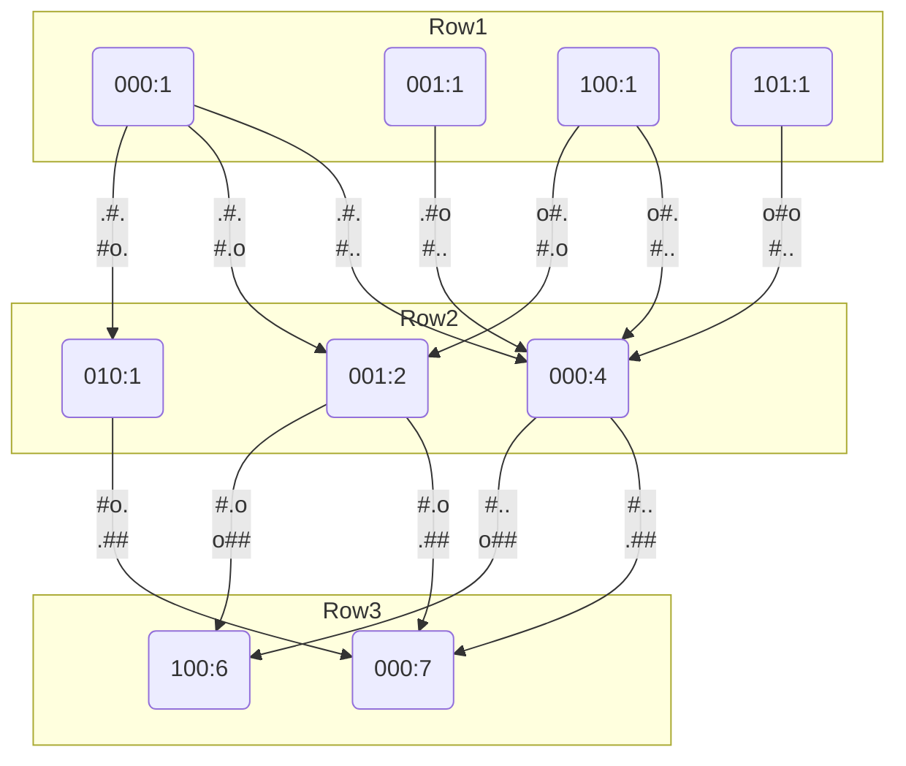
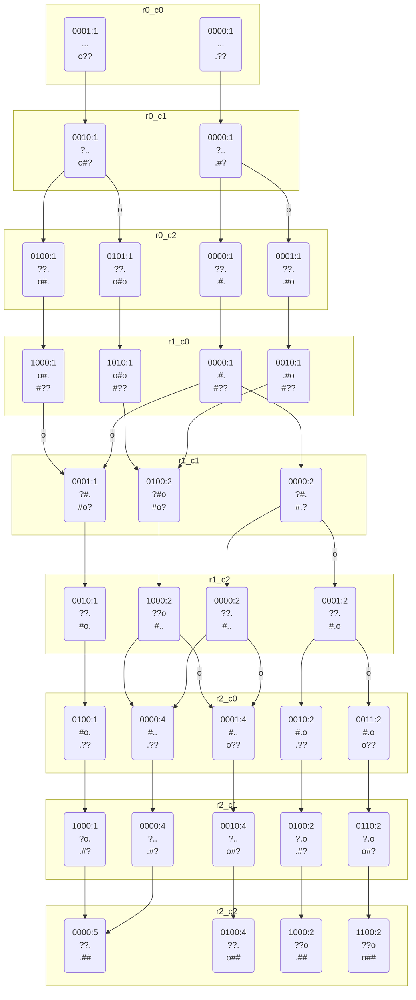

[023 \- Avoid War（★7）](https://atcoder.jp/contests/typical90/tasks/typical90_w)


# アルゴリズム

## 方針: 2次元DPの状態更新について

👑キングの周辺 8マスにほかのキングがあってはいけません。左上から順に状態を埋めていくと、一見 🔍 4つの 16状態だけから 👑 の状態が分かりそうに思います。

|||||||
|---|---|---|---|---|---|
||🔍|🔍|🔍|||
||🔍A|👑B||||
|||||||

👑B までのマスを左上から埋める状態数は、🔍A までのマスを左上から埋める状態数以上のはずです。

しかしこの方針では、うまく状態を混ぜることができません。

|||||||
|---|---|---|---|---|---|
|||||||
|🔍|🔍A|🔍B||||
|🔍|👑C|||||

|||||||
|---|---|---|---|---|---|
|||||||
||🔍A|🔍B|🔍|||
||🔍C|👑D||||

👑C までのマスを左上から埋める状態数は、🔍A までのマスを左上から埋める状態数以上のはずです。

👑D までのマスを左上から埋める状態数は、🔍B, 🔍C までのマスを埋める状態数以上です。B, C がそれぞれ別の依存関係で増えていると、D の状態数が分かりません。

2か所で状態数が増えると混ぜられません。状態が同じ規則で増え続けるようにします。たとえば 1つ上の行の状態を覚えるようにして、今調べている行も順次更新していく感じです。

|||||||
|---|---|---|---|---|---|
|||||||
|🗒️🔍|🗒️🔍|🗒️🔍|🗒️|🗒️|🗒️|
|📝🔍|👑C|||||

|||||||
|---|---|---|---|---|---|
|||||||
|🗒️|🗒️🔍|🗒️🔍|🗒️🔍|🗒️|🗒️|
|📝|📝🔍C|👑D||||

または行単位ではなく、今後参照することのある w + 1 個だけ覚える方法にします。こちらの方が効率的です。

|||||||
|---|---|---|---|---|---|
|||||||
|🗒️🔍|🗒️🔍|🗒️🔍|🗒️|🗒️|🗒️|
|🗒️🔍|👑C|||||

|||||||
|---|---|---|---|---|---|
|||||||
||🗒️🔍|🗒️🔍|🗒️🔍|🗒️|🗒️|
|🗒️|🗒️🔍C|👑D||||

## Bit DP / 行単位

```
.#.
#..
.##
```

1行目 `.#.` のキングの配置方法は `.#.`, `.#o`, `o#.`, `o#o` の 4通りあります。キングがあるところのビットを立てるように `0b000`, `0b001`, `0b100`, `0b101` と考えます。それぞれ 1通りです。



最後の行が埋まると、全状態数は 6+7 = 13 になります。

各行の状態数は 1行が 24列あると一見 2^24 そうですが、キングが隣り合わないため小さくなります。これでだいたい DP できます。

24×24 すべて配置可能な場合だけはとても重く、TLE します。決め打ちで答え `253474685` を入れてもと思いたくなるくらいです……。


## Bit DP / w + 1 個履歴管理

```
.#.
#..
.##
```

同じ盤面を 1マスずつ更新します。 `?` は考えなくて良いマスを表します。4マス分の履歴があれば、次のマスの状態数を求められます。



遷移数が増えましたが、それぞれのノードから矢印が 1本か 2本延びるだけと思うと、計算量はより軽いです。


# 実装例

## Bit DP / 行単位 (TLE)
https://github.com/hossy3/atcoder-solutions/blob/main/atcoder/typical90/src/bin/023_bit_dp_row_tle.rs

## Bit DP / w + 1 個履歴管理
https://github.com/hossy3/atcoder-solutions/blob/main/atcoder/typical90/src/bin/023_bit_dp_w_plus_1.rs
