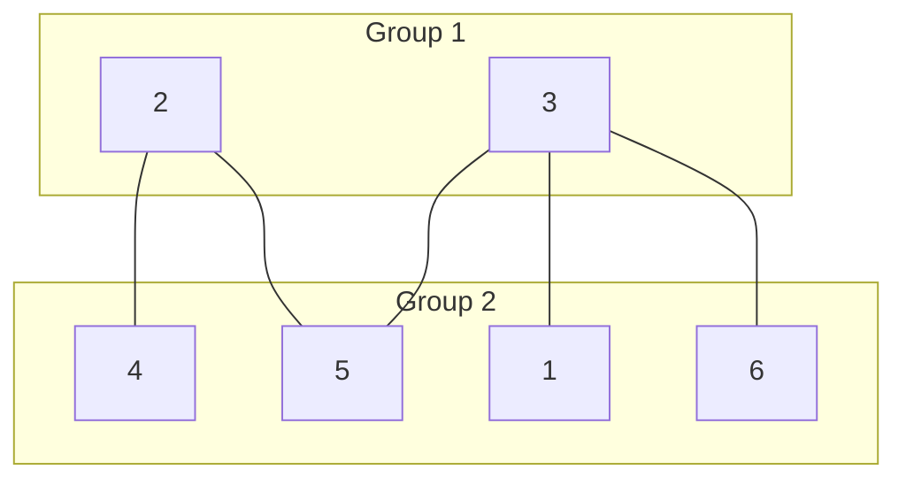
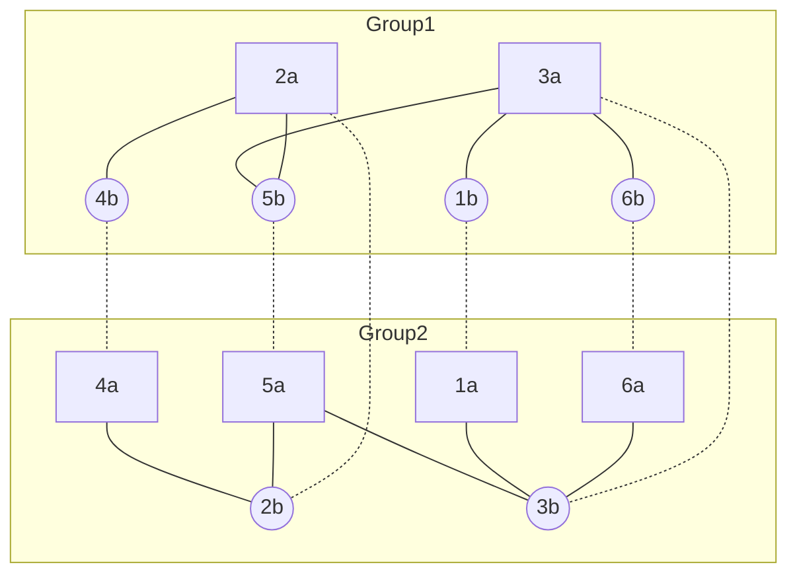

[026 \- Independent Set on a Tree（★4）](https://atcoder.jp/contests/typical90/tasks/typical90_z)


# アルゴリズム

## 方針: 二部グラフ

入力例 2 の木の隣接関係を考えます。



数の多い下側のグループから 3つ選べば、その 3つは隣り合っていませんので、どの組み合わせでも正解になります。`[1, 4, 5]`, `[1, 4, 6]` など。

このように、隣り合わないノードをまとめた 2つのグループ = 二部グラフ を作ると考えやすいです。

両方のグループを使った `[1, 2, 6]` も正解ですが、ここでは考えないことにします。

## DFS, BFS で組み立てる

2つのグループに対応した 2つの `BTreeSet` を用意し、深さ優先探索や幅優先探索で埋めていくイメージです:

|stack|(i, c)|i の隣|Group 0|Group 1|
|---|---|---|---|---|
|[(1, 0)]|||[]|[]|
|[]|(1, 0)|[3]|[1]|[]|
|[(3, 1)]|||[1]|[]|
|[]|(3, 1)|[1, 2, 5]|[1]|[3]|
|[(1, 0), (2, 0), (5, 0)]|||[1]|[3]|
|[(1, 0), (2, 0)]|(5, 0)|[2, 3]|[1, 5]|[3]|
|:|:|:|:|:|
|[]|||[1, 4, 5, 6]|[2, 3]|

```rust
let mut s = (BTreeSet::new(), BTreeSet::new());
let mut stack = vec![(ab[0].0, 0); 1];
while let Some((a, c)) = stack.pop() {
    let s = if c == 0 { &mut (s.0) } else { &mut (s.1) };
    if s.contains(&a) {
        continue;
    }
    s.insert(a);
    for x in &v[a] {
        stack.push((*x, 1 - c));
    }
}
```

## 頂点倍化 + Disjoint Set

ノードを 2倍に増やし、「1 と 3 が隣り合う」 を 「1a と 3b が同じグループ、1b と 3a が同じグループ」 というように表現しても良いです。

Disjoint Set (Union-Find) が使えます。 12 個のノードが入るように初期化し、 3b は 3+6 番目として扱います。

破線部はつなぎません。



```rust
let mut uf = Dsu::new(n * 2);
for &(a, b) in &ab {
    uf.merge(a, n + b);
    uf.merge(n + a, b);
}
```

# Tips

## テスト省略

* [cargo\-compete/README\-ja\.md at master · qryxip/cargo\-compete](https://github.com/qryxip/cargo-compete/blob/master/README-ja.md)

cargo-compete でテスト・提出している人向けです。

この問題のように複数の正解があると、 `cargo compete test 026` で正解のはずなのに不正解と返されることがあります。WEB に載っている正解例のみ受け付けるためです。 `submit` もテストに失敗するからとコード提出できません。

このような場合は、目で確認して良さそうなら  `cargo compete submit 026 --no-test` のように `--no-test` オプションを立てて提出できます。

`cargo compete submit --help` を見るとほかにもオプションがあります。テストが手元でタイムアウトするときに `--release` を付けると高速になる、というのは使うことがあります。

`cargo compete new typical90` したときに自動的に作られる想定入出力結果ファイル 026.yml を、手で書き換えるという方法もあります。


# 実装例

## 二部グラフ / DFS
https://github.com/hossy3/atcoder-solutions/blob/main/atcoder/typical90/src/bin/026_bipartite_set.rs

## 二部グラフ / 頂点倍化 + Disjoint Set
https://github.com/hossy3/atcoder-solutions/blob/main/atcoder/typical90/src/bin/026_bipartite_dsu.rs

