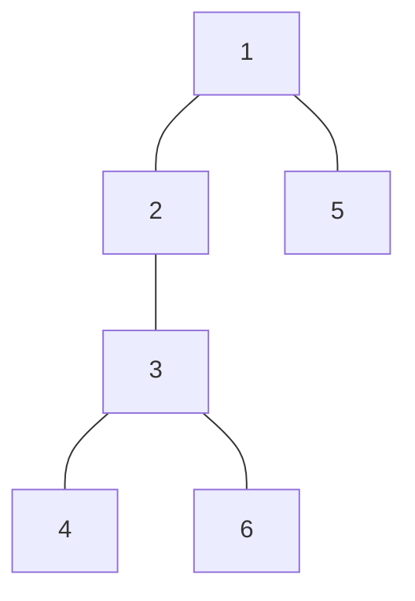
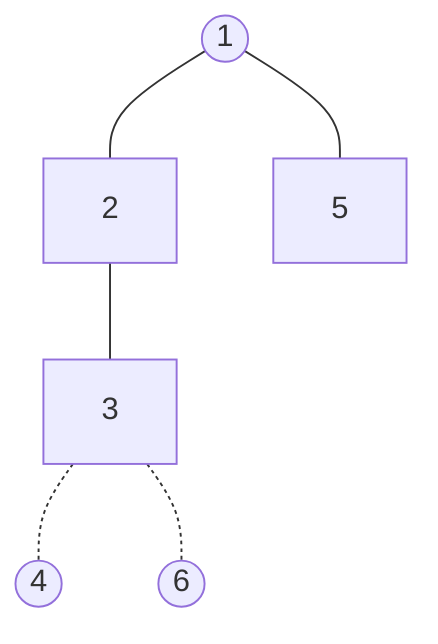
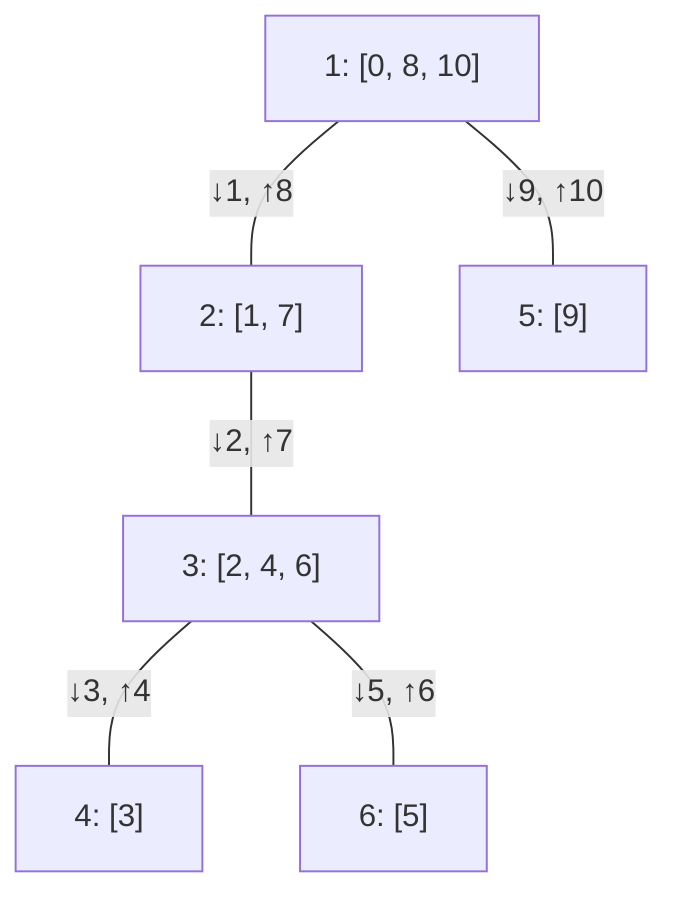
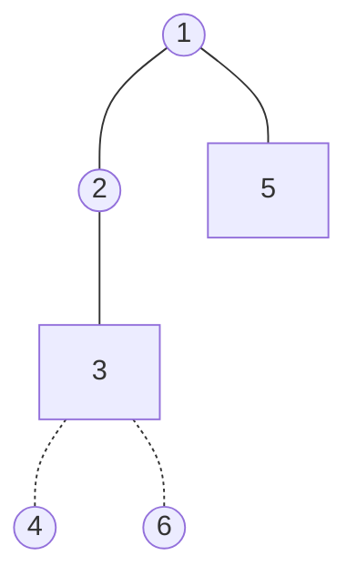
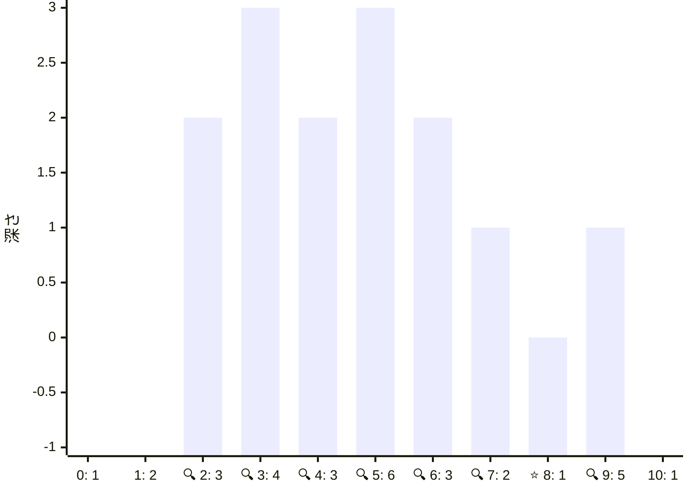
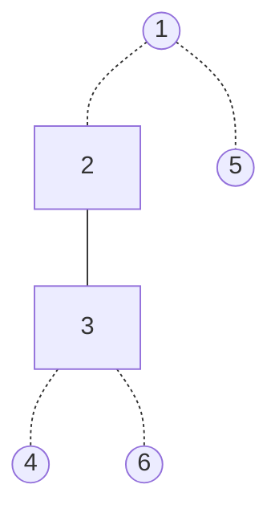
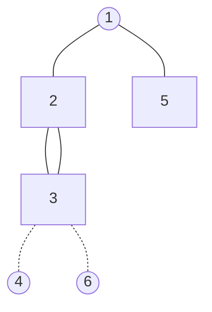
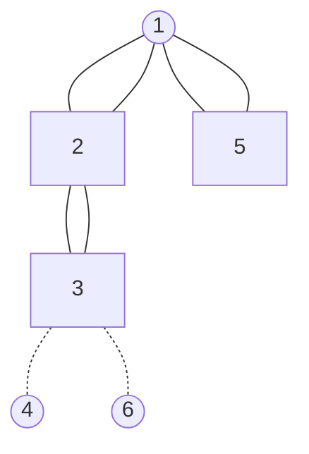

[035 \- Preserve Connectivity（★7）](https://atcoder.jp/contests/typical90/tasks/typical90_ai)


# 問題


上のような木があった時に、指定したいくつかの頂点をつなげるためには辺を何本残せば良いか、という問題です。

`[2, 3, 5]` の頂点をつなぐ場合は、つぎの 3本が正解となります。



`[1, 2]`, `[2, 3, 4, 5]` などのほかの頂点の組に対しても、素早く解答を求めたい、という問題です。


# アルゴリズム

しばらく、 2つの頂点をつなぐ方法を考えます。


## オイラーツアー

2つの頂点をつなぐ方法の材料として、「木のすべての頂点を辿る順番」を求めます。



|順番|0|1|2|3|4|5|6|7|8|9|10|
|---|---|---|---|---|---|---|---|---|---|---|---|
|頂点|1|2|3|4|3|6|3|2|1|5|1|
|深さ|0|1|2|3|2|3|2|1|0|1|0|

順番の個数は (辺の数 * 2 + 1) = (頂点の数 * 2 - 1) です。ここまでで 1周します。

木構造を再帰的にたどることで、順番を得られます。

```rust
fn euler_tour_impl(
    graph: &[Vec<usize>],
    i: usize,
    parent: usize,
    level: usize,
    v: &mut Vec<(usize, (usize, usize))>,
) {
    v.push((i, (parent, level)));
    for &j in graph[i].iter().rev() {
        if j != parent {
            euler_tour_impl(graph, j, i, level + 1, v);
            v.push((i, (parent, level)));
        }
    }
}

// Returns Vec<(node, (parent, level))>
fn euler_tour(s: usize, graph: &[Vec<usize>]) -> Vec<(usize, (usize, usize))> {
    let mut v = Vec::with_capacity(graph.len() * 2 - 1);
    euler_tour_impl(graph, s, s, 0, &mut v);
    v
}
```

## 最近共通祖先 LCA / オイラーツアーで求める

最近共通祖先 = LCA = 2頂点の親をたどり最初に重なる場所を見つけます。 `[3, 5]` からたどると `1` になります。 `1` が分かれば、 `[3, 5]` をつなぐ辺の本数は "(3 の深さ - 1の深さ) + (5 の深さ - 1 の深さ) = 2 + 1 = 3" のように求められます。



LCA はオイラーツアーの結果を使って求められます。頂点 3 から頂点 5 に移動するとき、深さは次の棒グラフのように変わります。この中で一番深さが小さな ⭐ 頂点 1 になります。



区間の最小値は、セグメント木で求められます。 2頂点の場合は次のようになります。セグメント木の区間 `l..=r` が逆順にならないように、事前に並び替えています。

```rust
fn f(mut v: Vec<usize>, preorder: &[usize], segtree: &Segtree<Min<usize>>) -> usize {
    let distance = |l: usize, r: usize| -> usize {
        let lca_level = segtree.prod(l..=r);
        (segtree.get(l) - lca_level) + (segtree.get(r) - lca_level)
    };

    v.sort_by_key(|&k| preorder[k]);
    distance(preorder[v[0]], preorder[v[1]]);
}
```

並び替えは、最初にそれぞれの頂点に着く `preorder` 行きがけ順としました。帰りがけ順でも良いです。

```rust
let mut preorder = vec![0; n];
for (i, &(x, _)) in paths.iter().enumerate().rev() {
    preorder[x] = i;
}
```

## 3頂点以上の場合

もういちど `[2, 3, 5]` の頂点をつなぐ場合を考えます。 2頂点の距離は先ほどのようにして `[2, 3]` → 1, `[3, 5]` → 3 と求められます。





このグラフを重ねると、辺を 2回通るところ、 1回通るところがあります。



`[2, 3, 5]` の始終点をつなぐ `[2, 5]` も追加してみます。そうすると、すべての辺を 2回通ることになります。



よって、正解は (`[2, 3]` の距離 + `[3, 5]` の距離 + `[1, 5]` の距離) / 2 となります。


```rust
fn f(mut v: Vec<usize>, preorder: &[usize], segtree: &Segtree<Min<usize>>) -> usize {
    let distance = |l: usize, r: usize| -> usize {
        let lca_level = segtree.prod(l..=r);
        (segtree.get(l) - lca_level) + (segtree.get(r) - lca_level)
    };

    v.sort_by_key(|&k| preorder[k]);

    let mut result = 0;
    for v in v.windows(2) {
        result += distance(preorder[v[0]], preorder[v[1]]);
    }
    result += distance(preorder[v[0]], preorder[v[v.len() - 1]]);

    result / 2
}
```

## 最近共通祖先 LCA / ダブリングで求める

オイラーツアーとセグメント木の代わりに、ダブリングでも解けます。次のような表を作ります。

|頂点|深さ|1つ上|2つ上|4つ上|8つ上|
|---|---|---|---|---|---|
|1|0|-|-|-|-|
|2|1|1|-|-|-|
|3|2|2|1|-|-|
|4|3|3|2|-|-|
|5|1|1|-|-|-|
|6|3|3|2|-|-|

頂点 6 と頂点 5 の最近共通祖先を探します。

深さが 3, 1 と異なりますので、まず深さを揃えます。頂点 6 の 2つ上は頂点 2。頂点 6 と頂点 5 の最近共通祖先は、頂点 2 と頂点 5 の最近共通祖先と同じになります。

ここから、表の右にある数字が揃っているかを見ると、最近共通祖先が分かります。

|頂点|深さ|1つ上|2つ上|4つ上|8つ上|
|---|---|---|---|---|---|
|2|1|1|-|-|-|
|5|1|1|-|-|-|

```rust
fn f(mut v: Vec<usize>, preorder: &[usize], parents: &[Vec<usize>], levels: &[usize]) -> usize {
    let nbits = parents[0].len();
    let lca = |mut l: usize, mut r: usize| -> usize {
        if levels[l] < levels[r] {
            swap(&mut l, &mut r);
        }
        for i in (0..nbits).rev() {
            if levels[l] - levels[r] >= 1 << i {
                l = parents[l][i];
            }
        }
        if l == r {
            return l;
        }

        for i in (0..nbits).rev() {
            if parents[l][i] != parents[r][i] {
                l = parents[l][i];
                r = parents[r][i];
            }
        }
        parents[l][0]
    };

    // 以下オイラーツアーと同じ
}
```


# 実装例

## オイラーツアー
https://github.com/hossy3/atcoder-solutions/blob/main/atcoder/typical90/src/bin/035_lca_euler_tour.rs

## ダブリング
https://github.com/hossy3/atcoder-solutions/blob/main/atcoder/typical90/src/bin/035_lca_doubling.rs

