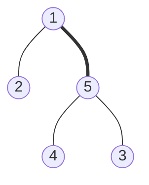
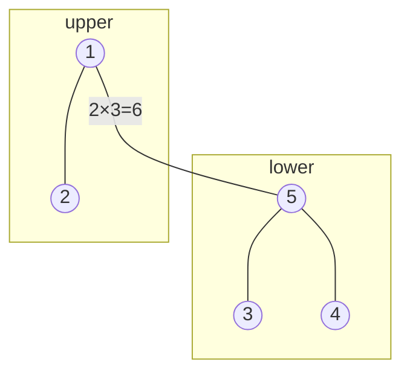
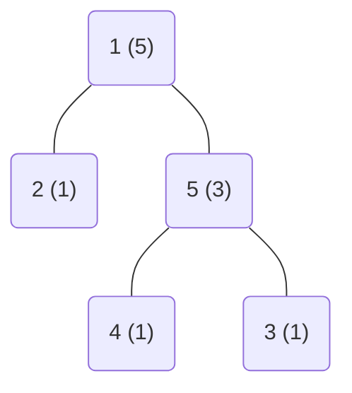

[039 \- Tree Distance（★5）](https://atcoder.jp/contests/typical90/tasks/typical90_am)


# アルゴリズム

## 主客転倒

公式解説のグラフです。すべての2頂点の組み合わせ (1, 2), (1, 3), (1, 4), (1, 5), (2, 3), (2, 4), (2, 5), (3, 4), (3, 5), (4, 5) を通る道筋の中で、太い 「1-5」間の辺を何回通るかを考えます。



1を含む上側のグループには 2つの頂点が、5を含む下側のグループには3つの頂点があります。そのため、2×3 = 6 回、この辺を通ります。



他の辺の使用回数も同様に、「下側の頂点数 × 上側の頂点数」で求められます。「上側の頂点数 = 全頂点数 - 下側の頂点数」です。

各頂点の下側の頂点数が分かっていれば、次のように合計を計算できます。

```rust
let mut count = 0;
for &(a, b) in &ab {
    let x = nums[a].min(nums[b]);
    count += x * (n - x);
}
```

今回の図示では頂点 1 を一番上に描いています。ほかの頂点を一番上にしても、同じ答えが得られます。

## DFS 深さ優先探索



各頂点が自分自身の下に頂点を持つかは、深さ優先探索で調べられます。

```rust
// nums: 各ノードの、自分自身と子孫の合計数
fn dfs(i: usize, parent: usize, graph: &[Vec<usize>], nums: &mut [usize]) -> usize {
    let mut count = 1;
    for &j in &graph[i] {
        if j != parent {
            count += dfs(j, i, graph, nums);
        }
    }
    nums[i] = count;
    count
}
```

# 実装例

## DFS
https://github.com/hossy3/atcoder-solutions/blob/main/atcoder/typical90/src/bin/039_dfs.rs
