[040 \- Get More Money（★7）](https://atcoder.jp/contests/typical90/tasks/typical90_an)


# アルゴリズム

## 燃やす埋める問題

私は「燃やす埋める問題」を知りませんでした。入力例 1 よりも簡単な例を積み重ねて、グラフで解くイメージを得られるようにします。

より詳しく知りたい方は、下記記事の 040 解説をどうぞ。

* [燃やす埋める問題とProject Selection Problemの整理 \#Java \- Qiita](https://qiita.com/tanaka-a/items/fb8d84c44190c7098047)

### 1. 家が1件の場合

* それぞれの家を訪れる場合は 5円消費する
* 🏠1 を訪れると 8円得られる

このときに、最大で何円得をするかを考えます。

もちろん、「🏠1 を訪れる: +3円」「訪れない: ±0円」 です。3円得をします。

これをグラフで考えます。

「5円消費する」「8円得られる」というように符号が変わると扱いにくいですので、最初から 🏠1 にある 8円を持っていることにします。

そして、🏠1 を訪れるなら5円払う、訪れないなら 8円払うと考えます。どちらかを選びます。両方払う、どちらも払わない、という選択肢はありません。

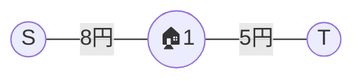

5円を選ぶ方が、支払いが少なく済みます。片方の選択肢を選ぶことを、グラフをカットすることで表現します。

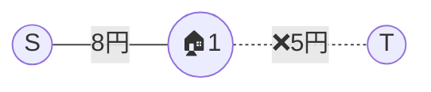

このグラフは、5円を支払い 🏠1 を訪れることを意味します。

グラフの流量を考えるときには有向グラフの方が扱いやすいです。次のように描くと、最小カットのように見えます。

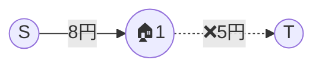

最大流と見ることもできます。両方の選択肢を通るグラフが、最大5円分を流せます。

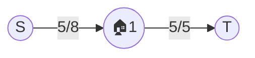

### 2. 家が2件, 鍵がない場合

* それぞれの家を訪れる場合は 5円消費する
* 🏠1 を訪れると 4円得られる
* 🏠2 を訪れると 8円得られる

このときに、最大で何円得をするかを考えます。

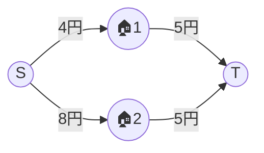

先ほど同様に、符号が変わると扱いにくいですので、最初から 🏠1 にある 4円と、🏠2 にある 8円、計 12 円とを持っていることにします。ここからの追加支払いを少なくする問題と考えます。

🏠1 は 4円支払いと 5円支払いのどちらかを選択します。4円の方が少ないです。🏠1 の中に入っている 4円を諦めるということは、🏠1 に訪れない、ということです。

🏠2 は先ほどと同じです。

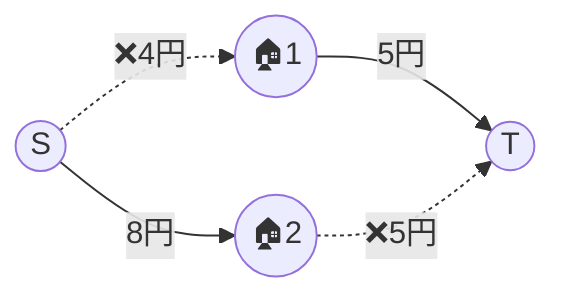

グラフのカットは、「家を訪れるグループ」「訪れないグループ」の 2つに分けることにも対応しています。訪れるグループは始点 S から到達可能、訪れないグループは到達不可能です。

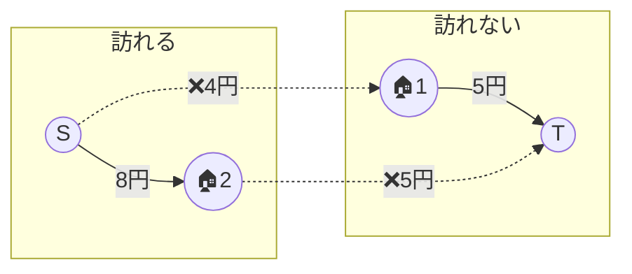

答えは (4 + 8) - (5 + 4) = 3円です。

### 3. 家が2件, 鍵が1本ある場合

* それぞれの家を訪れる場合は 5円消費する
* 🏠1 を訪れると 4円得られる
* 🏠2 を訪れると 8円得られる
* 🏠1 の中に、🏠2 に入るために必要な鍵 🔑 がある (New!)

このときに、最大で何円得をするかを考えます。

「🏠1 の中に、🏠2 に入るために必要な鍵 🔑 がある」を言い換えると、「🏠2 を訪れる場合は 🏠1 も訪れている」となります。

この条件を「🏠2 を訪れ、かつ 🏠1 を訪れないためには、∞ 円追加支払いをする」という形で描きます。グラフに経路を一本追加します。

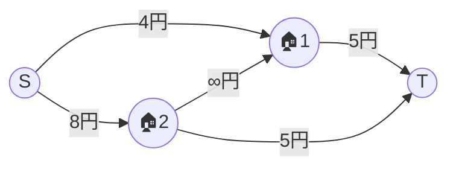

∞円の経路が増えたことで、鍵がない場合のカットではグループ分けできなくなりました。

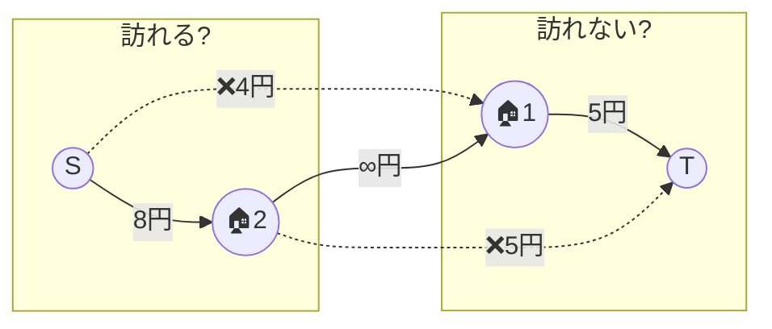

正しい最小カットはこちらです:

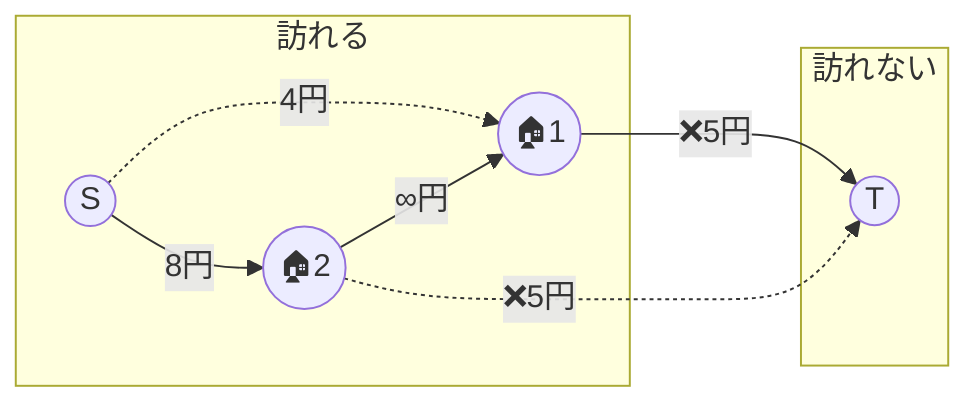

答えは (8 + 4) - (5 + 5) = 2円です。

### 4. 家が5件, 鍵が3本ある場合

公式問題の入力例1 と同じです。

* それぞれの家を訪れる場合は 5円消費する
* 🏠1 を訪れると 5円得られる
* 🏠2 を訪れると 2円得られる
* 🏠3 を訪れると 10円得られる
* 🏠4 を訪れると 3円得られる
* 🏠5 を訪れると 6円得られる
* 🏠1 の中に、🏠3 に入るために必要な鍵 🔑 がある
* 🏠2 の中に、🏠3 に入るために必要な鍵 🔑 がある
* 🏠4 の中に、🏠5 に入るために必要な鍵 🔑 がある

同じように、「🏠3 を訪れる場合は 🏠1, 🏠2 両方とも訪れている」「🏠5 を訪れる場合は 🏠4 も訪れている」という流路を追加します。

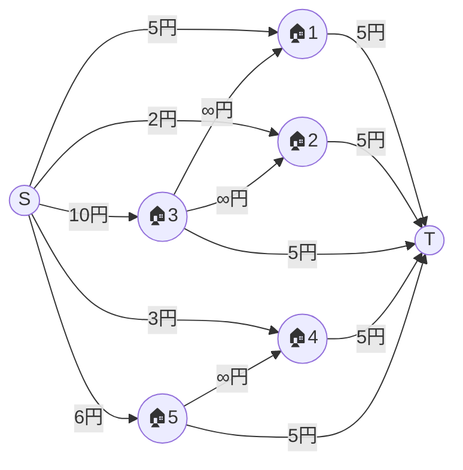


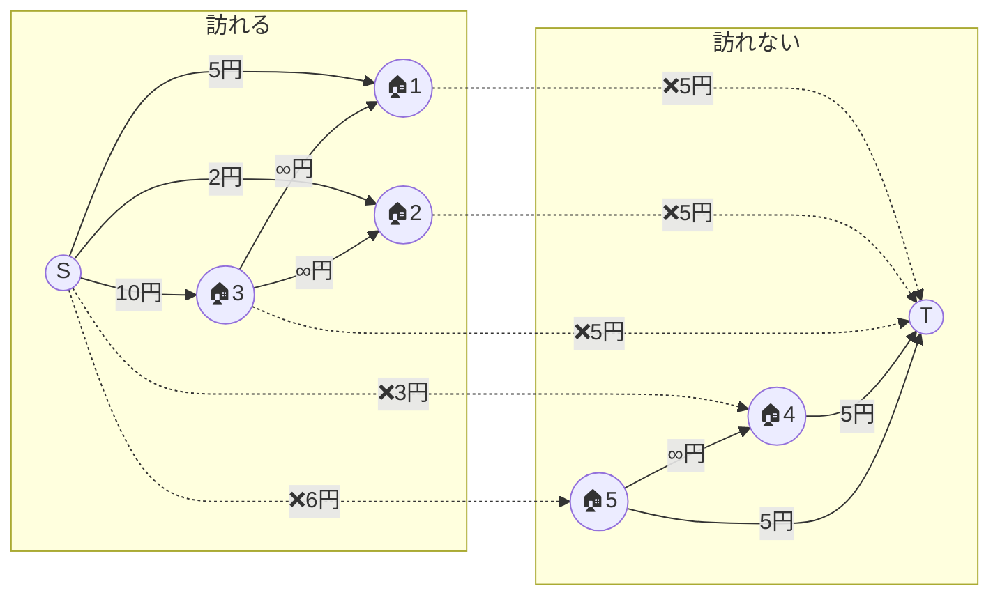

最小カットを解き、小さな数字の家から順に訪れることで解けます。

正解は (5 + 2 + 10 + 3 + 6) - (5 + 5 + 5 + 3 + 6) = 2円 です。


## 最小カット, 最大流 (MfGraph)

[MfGraph in ac\_library::maxflow \- Rust](https://docs.rs/ac-library-rs/0.1.1/ac_library/maxflow/struct.MfGraph.html)

ac_library の `MfGraph` をそのまま使えます。

```rust
let mut graph = MfGraph::<usize>::new(n + 2);
let s = n;
let t = n + 1;

for (i, c) in m.iter().enumerate() {
    for &c in c {
        graph.add_edge(c, i, usize::MAX); // 鍵がかかっている c には先に入れない
    }
}
for (i, &a) in a.iter().enumerate() {
    graph.add_edge(s, i, a); // 家に入らないときに a 円得られなくなる
    graph.add_edge(i, t, w); // 家に入るときに w 円消費する
}
let flow = graph.flow(s, t);
let result = a.iter().sum::<usize>() - flow;
println!("{result}");
```

頂点の番号は、次のように 0開始にしました。始終点にも割り振っています。

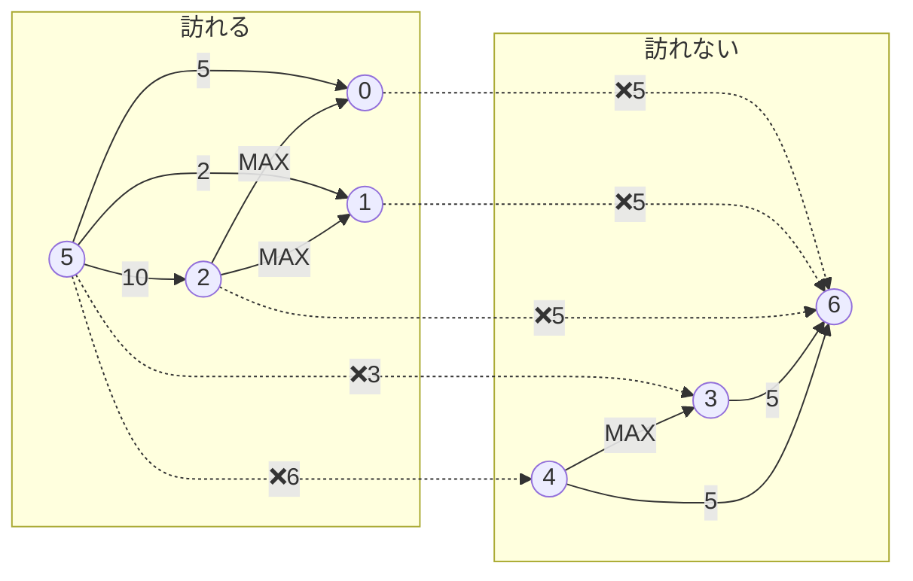


# 実装例

## 最小カット, 最大流 (MfGraph)
https://github.com/hossy3/atcoder-solutions/blob/main/atcoder/typical90/src/bin/040_maxflow.rs
