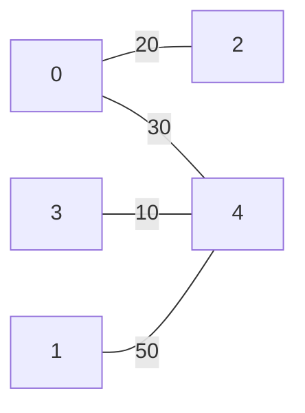
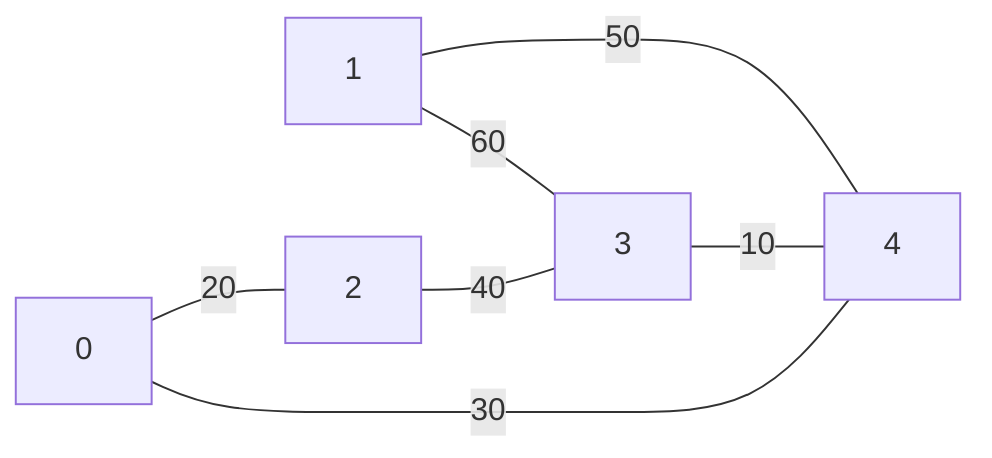
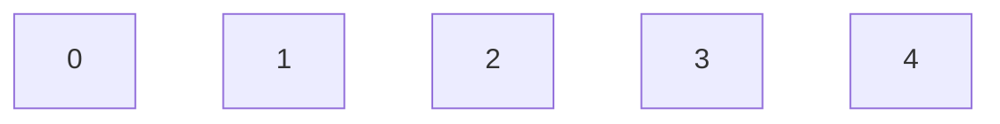
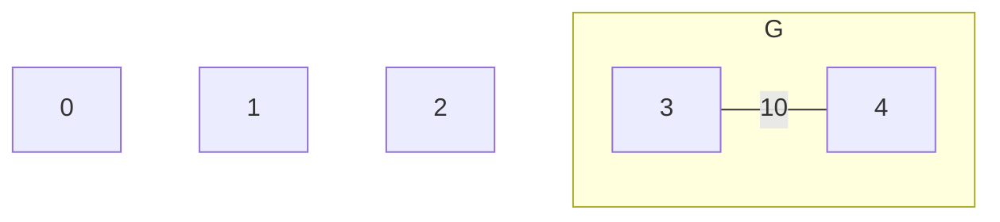
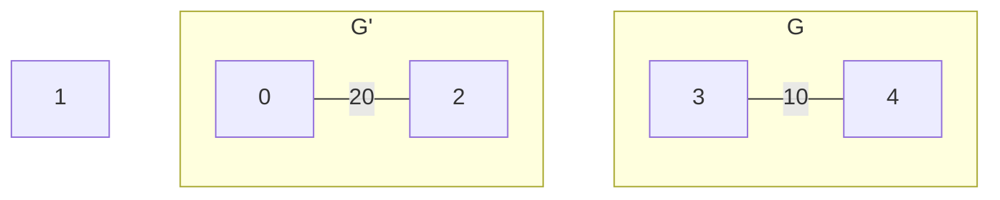
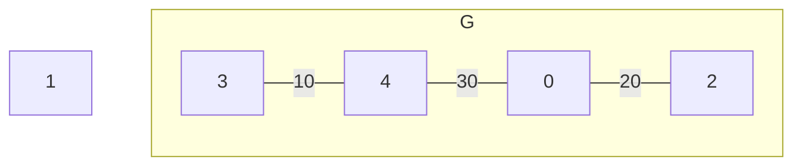
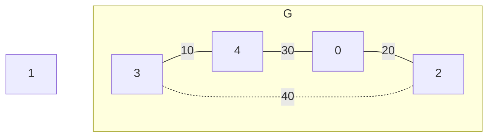
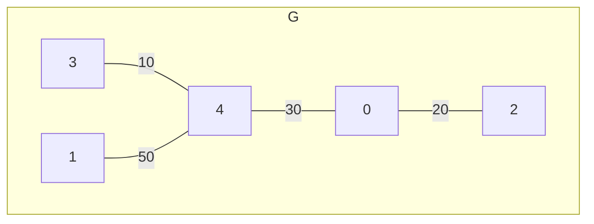
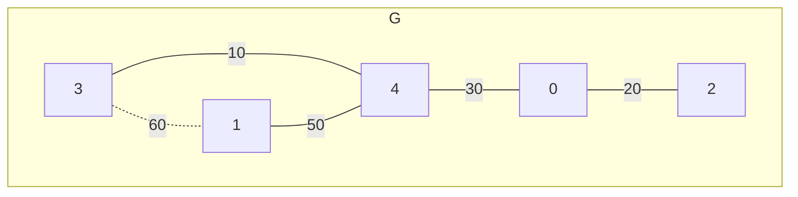

[049 \- Flip Digits 2（★6）](https://atcoder.jp/contests/typical90/tasks/typical90_aw)


# アルゴリズム

## 例題

次の入力例を考えます。

```
4 6
10 1 4
20 1 2
30 4 4
40 3 3
50 2 4
60 2 3
```

|i|cost|l|r|bit列|
|---|---|---|---|---|
|0|10|4|4|`0001`|
|1|20|1|2|`1100`|
|2|30|1|4|`1111`|
|3|40|3|3|`0010`|
|4|50|2|4|`0111`|
|5|60|2|3|`0110`|

ビット列の `1` は反転を示します。

初期 `T` = `0000` に対し、この 6つのアイテムのうち 4つ `0001`, `1100`, `1111`, `0111` を選択し、 XOR を計算することで、4文字のビット列 `T` 全通りを表現できます。

|`0001`|`1100`|`1111`|`0111`|T|
|---|---|---|---|---|
|||||`0000`|
|✅`0001`||||`0001`|
|✅`0001`|✅`1100`|✅`1111`||`0010`|
||✅`1100`|✅`1111`||`0011`|
||✅`1100`|✅`1111`|✅`0111`|`0100`|
|✅`0001`|✅`1100`|✅`1111`|✅`0111`|`0101`|
|✅`0001`|||✅`0111`|`0110`|
||||✅`0111`|`0111`|
|||✅`1111`|✅`0111`|`1000`|
|✅`0001`||✅`1111`|✅`0111`|`1001`|
|✅`0001`|✅`1100`||✅`0111`|`1010`|
||✅`1100`||✅`0111`|`1011`|
||✅`1100`|||`1100`|
|✅`0001`|✅`1100`|||`1101`|
|✅`0001`||✅`1111`||`1110`|
|||✅`1111`||`1111`|

この全通りを表現できるような、もっともコストの小さいアイテム群を探す、という問題です。

4文字の `01` = 4ビットなら、 4つのアイテムがあれば良さそうです。


## 累積和のように考える

変化するビットの数が 1～4 個とバラバラだと扱いづらいです。そこで累積和のように、ビットが変化する場所を考えます。これは常に 2つです。

|i|cost|l|r|bit列|累積和|
|---|---|---|---|---|---|
|0|10|4|4|`0001`|`...!!`|
|1|20|1|2|`1100`|`!.!..`|
|2|30|1|4|`1111`|`!...!`|
|3|40|3|3|`0010`|`..!!.`|
|4|50|2|4|`0111`|`.!..!`|
|5|60|2|3|`0110`|`.!.!.`|

先ほどの 4つのアイテムを使った 16通りの表を、累積和で書き直します。

|`0001`<br />`...!!`|`1100`<br />`!.!..`|`1111`<br />`!...!`|`0111`<br />`.!..!`|T|累積和|
|---|---|---|---|---|---|
|||||`0000`|`.....`
|✅`...!!`||||`0001`|`...!!`
|✅`...!!`|✅`!.!..`|✅`!...!`||`0010`|`..!!.`
||✅`!.!..`|✅`!...!`||`0011`|`..!.!`
||✅`!.!..`|✅`!...!`|✅`.!..!`|`0100`|`.!!..`
|✅`...!!`|✅`!.!..`|✅`!...!`|✅`.!..!`|`0101`|`.!!!!`
|✅`...!!`|||✅`.!..!`|`0110`|`.!.!.`
||||✅`.!..!`|`0111`|`.!..!`
|||✅`!...!`|✅`.!..!`|`1000`|`!!...`
|✅`...!!`||✅`!...!`|✅`.!..!`|`1001`|`!!.!!`
|✅`...!!`|✅`!.!..`||✅`.!..!`|`1010`|`!!!!.`
||✅`!.!..`||✅`.!..!`|`1011`|`!!!.!`
||✅`!.!..`|||`1100`|`!.!..`
|✅`...!!`|✅`!.!..`|||`1101`|`!.!!!`
|✅`...!!`||✅`!...!`||`1110`|`!..!.`
|||✅`!...!`||`1111`|`!...!`

どのアイテムも `!` 2つで表せています。


## グラフで考える

引き続き、選んだ 4つのアイテムの、`!` の位置を見ます。

|i|cost|l|r|bit列|累積和|`!` の位置|
|---|---|---|---|---|---|---|
|0|10|4|4|`0001`|`...!!`|3, 4番目|
|1|20|1|2|`1100`|`!.!..`|0, 2番目|
|2|30|1|4|`1111`|`!...!`|0, 4番目|
|4|50|2|4|`0111`|`.!..!`|1, 4番目|

`!` の左の位置は `l - 1`、右の位置は `r` と同じになります。

グラフを描きます。`!` の位置をグラフの頂点、アイテムをグラフの辺とします。



これはつまり、「コストが最も小さな連結グラフを作る」問題です。最小全域木です。

使わなかった 2つのアイテムを含めたもとの問題に戻ると、5頂点 6辺 のグラフがあり、



すべての頂点が連結したまま、辺を減らしていく問題となります。


## Kruskal 法: 最小全域木を Disjoint Set で解く

|i|cost|l - 1|r|bit列|累積和|
|---|---|---|---|---|---|
|0|10|3|4|`0001`|`...!!`|
|1|20|0|2|`1100`|`!.!..`|
|2|30|0|4|`1111`|`!...!`|
|3|40|2|3|`0010`|`..!!.`|
|4|50|1|4|`0111`|`.!..!`|
|5|60|1|3|`0110`|`.!.!.`|

Disjoint Set (Union Find) を使って最小全域木を作ります。まず、候補の頂点 0, 1, 2, 3, 4 を登録します。



ここからアイテムを、コストの小さな順に、効果があるなら使うということを繰り返します。

アイテム0 を確認します。頂点 3, 4 は別グループです。採用し、つなぎます。



アイテム1 を確認します。頂点 0, 2 は別グループです。採用し、つなぎます。



アイテム2 を確認します。頂点 0, 4 は別グループです。採用し、つなぎます。


アイテム3 を確認します。頂点 2, 3 はすでに同じグループです。効果がないため没にします。


アイテム4 を確認します。頂点 1, 4 は別グループです。採用し、つなぎます。


アイテム5 を確認します。頂点 1, 3 はすでに同じグループです。効果がないため没にします。



すべての操作を終えた時に、1つのグループになっていなければ、条件を満たせません。

次のようなコードになります。

```rust
fn f(n: usize, clr: &[(i64, usize, usize)]) -> i64 {
    let mut result = 0i64;
    let mut uf = Dsu::new(n + 1);
    let mut clr = Vec::from_iter(clr.iter());
    clr.sort();
    for &&(c, l, r) in clr.iter() {
        if !uf.same(l, r + 1) {
            uf.merge(l, r + 1);
            result += c;
        }
    }

    if (0..n).any(|i| !uf.same(i, n)) {
        result = -1;
    }
    result
}
```

## Kruskal (pathfinding)

* [kruskal in pathfinding::undirected::kruskal \- Rust](https://docs.rs/pathfinding/latest/pathfinding/undirected/kruskal/fn.kruskal.html)

Kruskal 法は pathfinding にそのままお任せできます。

```rust
fn f(n: usize, clr: &[(i64, usize, usize)]) -> i64 {
    let edges: Vec<_> = clr.iter().map(|&(c, l, r)| (l, r + 1, c)).collect();
    let v: Vec<_> = kruskal(&edges).collect();
    if v.len() == n {
        v.iter().map(|(_, _, c)| c).sum::<i64>()
    } else {
        -1
    }
}
```


# 実装例

## Kruskal (DSU)
https://github.com/hossy3/atcoder-solutions/blob/main/atcoder/typical90/src/bin/049_kruskal.rs

## Kruskal (pathfinding)
https://github.com/hossy3/atcoder-solutions/blob/main/atcoder/typical90/src/bin/049_pathfinding.rs

