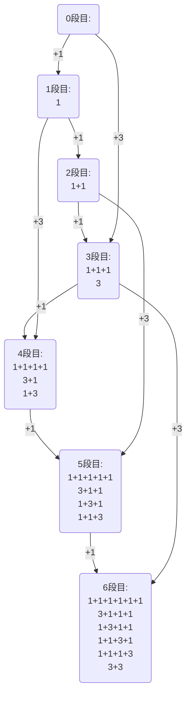
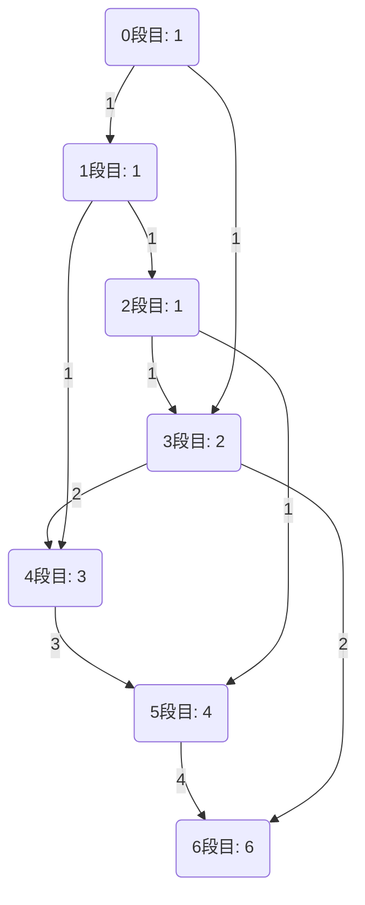

[050 \- Stair Jump（★3）](https://atcoder.jp/contests/typical90/tasks/typical90_ax)


# アルゴリズム

## 問題

6段の階段を、1段または3段ずつ移動する方法は何通りあるか考えます。

* 1+1+1+1+1+1
* 1+1+1+3
* 1+1+3+1
* 1+3+1+1
* 3+1+1+1
* 3+3

6通りあります。これが答えです。

6段目までのすべての移動方法を書き並べるなら、こうなります。



## DP で考える

階段の段数が少ないと列挙できます。しかし、段数が増えると指数関数的にパターンが増えてしまいます。もっと単純に考えたいです。

先ほどの 6通りをのうち、3段目を通る場合を見直します。

* (1+1+1) + (1+1+1)
* (1+1+1) + 3
* 3 + (1+1+1)
* 3 + 3

3段目までを "1+1+1", "3" どちらの方法でたどり着いても、その次の3段の手順は変わりません。「3段目にたどり着く方法が2通り」とだけ分かっていれば十分です。それまでの詳細は忘れて良いです。

というわけで、各段にたどり着く方法が何通りの方法あるか、という DP を考えます。



先ほどのグラフより単純になりました。


## 配る DP

各段にたどり着いたとき 🔍 に、1段先と3段先の数を更新する方法です。これで解けます。

|i|0|1|2|3|4|5|6|
|---|---|---|---|---|---|---|---|
||1|||||||||||
|0|🔍1|⚡1||⚡1|||
|1|1|🔍1|⚡1|1|⚡1|||
|2|1|1|🔍1|⚡1+1|1|⚡1||
|3|1|1|1|🔍2|⚡1+2|1|⚡2|
|4|1|1|1|2|🔍3|⚡1+3|2|
|5|1|1|1|2|3|🔍4|⚡2+4|
|6|1|1|1|2|3|4|🔍6|

```rust
let mut dp = vec![Mint::new(0); n + 1];
dp[0] = Mint::new(1);
for i in 0..n {
    let x = dp[i];
    dp[i + 1] += x;
    if i + l <= n {
        dp[i + l] += x;
    }
}
```

## 貰う DP


各段にたどり着く方法は 1段前と 3段前にたどり着く方法の合計で求まる、という方法です。こちらでも解けます。

|i|0|1|2|3|4|5|6|
|---|---|---|---|---|---|---|---|
|0|⚡1|||||||||||
|1|🔍1|⚡1|||||
|2|1|🔍1|⚡1|||||
|3|🔍1|1|🔍1|⚡1+1||||
|4|1|🔍1|1|🔍2|⚡1+2|||
|5|1|1|🔍1|2|🔍3|⚡1+3||
|6|1|1|1|🔍2|3|🔍4|⚡2+4|

```rust
let mut dp = vec![Mint::new(0); n + 1];
dp[0] = Mint::new(1);
for i in 1..=n {
    if i < l {
        dp[i] = dp[i - 1];
    } else {
        dp[i] = dp[i - 1] + dp[i - l];
    }
}
```

# Tips

## DP で組み込み型以外を操作するときは所有権に注意

先ほどの配る DP のコードです。
```rust
let x = dp[i];
dp[i + 1] += x;
```

`x` で受けなくても、1行で書きたくなると思います。

```rust
dp[i + 1] += dp[i];
```

しかし modint と併用してこのように書くと、所有権の関係でコンパイラーに怒られます。

```
dp[i + l] += dp[i];
-------------^^---
|            |
|            immutable borrow occurs here
mutable borrow occurs here
mutable borrow later used here
```

`dp[i + l] +=` と書くと、 代入が終わるまで `dp` 配列全体を可変な借用をします。 `dp` を可変な借用をしている間は、 `dp` を不変であっても参照できなくなります。

整数型では `dp[i + 1] += dp[i]` は良く行います。なぜ…… と思って調べたところ、解説記事を見つけました。

* [Rust の借用検査は組込の複合代入演算子に対して特殊な動作を行う \- 何とは言わない天然水飲みたさ](https://blog.cardina1.red/2019/07/29/borrowck-and-builtin-compound-assign/)

`dp[i + 1] = dp[i + 1] + dp[i]` で可変参照な `dp[i + 1]` と不変参照な `dp[i]` を足し合わせるのは所有権的にはダメです。でも組み込み型に関しては、右辺の `dp[i + 1]` を不変参照とみなして、不変参照同士の足し算ができる、ということのようです。難しい……。

先に `dp[i]` の値を `x` にコピーしておけば、可変参照と他の参照が重ならなくなります。

```rust
let x = dp[i];
dp[i + 1] += x;
```

または、右辺の計算を先に行い、代入する瞬間にだけ可変扱いにする、というのも良いです。

```rust
dp[i + 1] = dp[i + 1] + dp[i];
```

Rust は安全なコードを書きやすい利点がありますが、このようにコンパイラーの指摘が厳しいこともあります。競技プログラミングでは時間を取られてしまうこともあります。 C++ だと全然気にしなくていいところです。


# 実装例

## 配る DP
https://github.com/hossy3/atcoder-solutions/blob/main/atcoder/typical90/src/bin/050_modint_1.rs

## 貰う DP
https://github.com/hossy3/atcoder-solutions/blob/main/atcoder/typical90/src/bin/050_modint_2.rs
