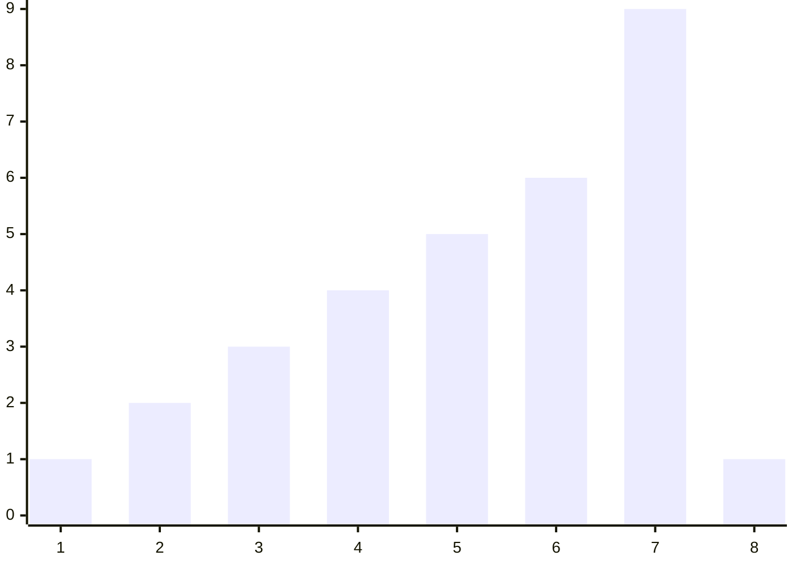

[053 \- Discrete Dowsing（★7）](https://atcoder.jp/contests/typical90/tasks/typical90_ba)


# アルゴリズム
## 問題


`(1,2,3,4,5,6,9,1)` のように、途中まで昇順、そこから先は降順に並ぶ数列があります。

この中でにあるもっとも大きな値 `9` を、できるだけ少ない問い合わせ回数で探す、というインタラクティブ問題です。


## クエリー回数に対する、扱える最長の数列を考える

数列からクエリー (問い合わせ方法) を考えるのは難しいです。逆に、どうすればもっとも効率的なクエリーになるかを、例をもとに考えます。


### クエリー 1回: 1要素の数列

||$A_1$|
|---|---|
|問い合わせ|🔍|
|値の例|1👍|

1回問い合わせれば、 1要素の数列内の最大値が分かります。

### クエリー 2回: 2要素の数列

||$A_1$|$A_2$|
|---|---|---|
|問い合わせ|🔍|🔍|
|値の例|1|2👍|

2回問い合わせれば、 2要素の数列内の最大値が分かります。

### クエリー 3回: 4要素の数列

||$A_1$|$A_2$|$A_3$|$A_4$|
|---|---|---|---|---|
|問い合わせ|❔|🔍|🔍|❔|
|値の例|1|4👍|3👎|2|
|次の候補|🔍|🔍|❌|❌|

||$A_1$|$A_2$|$A_3$|$A_4$|
|---|---|---|---|---|
|問い合わせ|❔|🔍|🔍|❔|
|値の例|1|2👎|3👍|4|
|次の候補|❌|❌|🔍|🔍|

1回の問い合わせで、1つ前の「2要素の配列」まで絞り込める配列を考えます。

追加で「2要素の配列」の隣の $A_3$ を調べることにします。クエリー2回の場合と重なりませんので、情報の無駄がないはずです。

「❔🔍🔍」になりました。

次に、左右対称にします。 $A_4$ を追加します。左の🔍を選んでも右の🔍を選んでも効率が変わらないように、です。❔を右に 1つ増やします。

 「❔🔍🔍❔」になりました。4要素の配列です。

$A_2$ と $A_3$ を比べ、$A_2$ が大きければ左側を、$A_3$ が大きければ右側を調べるようにします。どちらも 2要素で、かつ次に調べたい 🔍 の一方を調べ終えている状態です。無駄なく次のステップに進められます。


### クエリー 4回: 7要素の数列

||$A_1$|$A_2$|$A_3$|$A_4$|$A_5$|$A_6$|$A_7$|
|---|---|---|---|---|---|---|---|
|問い合わせ|❔|❔|🔍|❔|🔍|❔|❔|
|値の例|2|4|6👍|7|5👎|3|1|
|次の候補|❔|🔍|🔍|❔|❌|❌|❌|

||$A_1$|$A_2$|$A_3$|$A_4$|$A_5$|$A_6$|$A_7$|
|---|---|---|---|---|---|---|---|
|問い合わせ|❔|❔|🔍|❔|🔍|❔|❔|
|値の例|2|3|4👎|5|6👍|7|1|
|次の候補|❌|❌|❌|❔|🔍|🔍|❔|

同じように、1回の問い合わせで、1つ前の「4要素の配列」まで絞り込める配列を考えます。

追加で「4要素の配列」の隣の $A_5$ を調べることにします。クエリー2回の場合と重なりませんので、情報の無駄がないはずです。

「❔❔🔍❔🔍」になりました。

次に、左右対称にします。 $A_6, A_7$ を追加します。❔を右に 2つ増やします。

「❔❔🔍❔🔍❔❔」になりました。7要素の配列です。

$A_3$ と $A_5$ を比べ、$A_3$ が大きければ左側を、$A_5$ が大きければ右側を調べるようにします。どちらも 2要素です。無駄なく次のステップに進められます。

### クエリー n回

|クエリー数|数列と調べ方|🔍左位置|🔍右位置|数列の長さ|
|---|---|---|---|---|
|1|🔍|-|1|1|
|2|🔍🔍|1|2|2|
|3|❔🔍🔍❔|2|3|4|
|4|❔❔🔍❔🔍❔❔|3|5|7|
|5|❔❔❔❔🔍❔❔🔍❔❔❔❔|5|8|12|
|6|(略)|8|13|20|
|7|(略)|13|21|33|
|8|(略)|21|34|54|
|9|(略)|34|55|88|
|10|(略)|55|89|143|
|11|(略)|89|144|232|
|12|(略)|144|233|376|
|13|(略)|233|377|609|
|14|(略)|377|610|986|
|15|(略)|610|987|1596|

これはフィボナッチ数列の計算と同じです。

数列の長さが 1500 までなら、最大 15回問い合わせることで最大値が求まることが分かります。

数式でも考えます。

左右対称になるように 🔍 を置こうとすると、前回の左の 🔍 までの形を右側に追加します。 $R_{i+1}=L_{i+1}+L_i$ のようになります。

数列の長さは、次の右の 🔍 位置より 1 小さくなります。$W_i=R_{i+1}-1$ です。

|クエリー数|数列と調べ方|🔍左位置 $L_i$|🔍右位置 $R_i$|数列の長さ $W_i$|
|---|---|---|---|---|
|1|🔍|-|$R_1=1$|$W_1=R_2-1=1$|
|2|🔍🔍|$L_2=R_1=1$|$R_2=2$|$W_2=R_3-1=2$|
|3|❔🔍🔍❔|$L_3=R_2=2$|$R_3=L_3+L_2=3$|$W_3=R_4-1=4$|
|4|❔❔🔍❔🔍❔❔|$L_4=R_3=3$|$R_4=L_4+L_3=5$|$W_4=R_5-1=7$|
|5|❔❔❔❔🔍❔❔🔍❔❔❔❔|$L_5=R_4=5$|$R_5=L_5+L_4=8$|$W_5=R_6-1=12$|

* $L_{i+1} = R_{i}$
* $R_{i+1} = L_{i+1} + L_i$

L 側にまとめると

* $L_{i+2} = L_{i+1} + L_i$

確かにフィボナッチ数列の式でした。


## 最長でない数列の場合

クエリー回数に対して最長の配列は分かりました。では、最長でないものも同じように扱えるでしょうか。確認します。

(1, 2, 3, 4, 5, 6, 7, 8, 9) という配列が隠れている場合について調べます。

||$A_1$|$A_2$|$A_3$|$A_4$|$A_5$|$A_6$|$A_7$|$A_8$|$A_9$||
|---|---|---|---|---|---|---|---|---|---|---|
|値|1|2|3|4|5|6|7|8|9|
|問い合わせ|❔|❔|❔|❔|🔍|❔|❔|🔍|❔|
|比較|||||👎|||👍||
|次の候補|❌|❌|❌|❌|❌|❔|❔|🔍|❔|🔍❔❔

右の候補の 🔍 がはみ出しています。この場合は調べるのをスキップして、次の候補に進めば良いです。 `-1` など必ず負ける値を返す形でも良いです。

||$A_1$|$A_2$|$A_3$|$A_4$|$A_5$|$A_6$|$A_7$|$A_8$|$A_9$||
|---|---|---|---|---|---|---|---|---|---|---|
|値|1|2|3|4|5|6|7|8|9|
|問い合わせ|❔|❔|❔|❔|🔍|❔|❔|🔍|❔|
|比較|||||👎|||👍||
|次の候補|❌|❌|❌|❌|❌|❔|❔|🔍|❔|🔍❔❔
|比較||||||||👍||👎
|次の候補||||||❔|🔍|🔍|❔|❌❌❌
|比較|||||||👎|👍||
|次の候補||||||❌|❌|🔍|🔍|
|比較||||||||👎|👍|
|次の候補||||||||❌|🔍|

||$A_1$|$A_2$|$A_3$|$A_4$|$A_5$|$A_6$|$A_7$|$A_8$|$A_9$||
|---|---|---|---|---|---|---|---|---|---|---|
|問い合わせ||||||❔|🔍|🔍|❔|
|値の例|1|2|3|4|5|6|7👎|8👍|9|
|次の候補||||||❌|❌|🔍|🔍|

最長でない数列についても、最大値を求めることができました。


## インタラクティブ問題の入出力

* [proconio \- Rust > Interactive version](https://docs.rs/proconio/0.5.0/proconio/#interactive-version)

```diff rust
-input! {
+input_interactive! {
     t: usize,
 }
```

AtCoder のインタラクティブ問題では、値の入力の際に `input_interactive!` を使うと便利です。

インタラクティブ問題以外では、`input!` を使います。パフォーマンスを優先し、入力値をまとめて読み込みます。入力と出力を交互に繰り返す場合にはうまく動かず、TLE になってしまいます。

AtCoder 2023年言語アップデート以前は `input_interactive!` が使えませんでした。楽になりました。


## メモ化

4つの値の最大値を調べるコードを考えます。

||$A_1$|$A_2$|$A_3$|$A_4$|
|---|---|---|---|---|
|値|1|2|3|4|
|問い合わせ1|❔|🔍|🔍|❔|
|比較||👎|👍|
|問い合わせ2|❌|❌|🔍|🔍|
|比較|||👎|👍

問い合わせごとに 🔍 を 2つ調べるなら、次のように絞り込みを行えます。

```rust
let query = |i: usize| -> usize {
    println!("? {}", i);
    input_interactive! {
        x: usize,
    }
    x
};

let mut l = 0;
for v in fibo.windows(2).rev() {
    let l0 = l + v[0];
    let r0 = l + v[1];
    if r0 > n {
        continue;
    }
    if query(r0) > query(l0) {
        l = l0;
    }
}
query(l + 1)
```

同じ場所に対して 2回問い合わせています。最大 15回の問い合わせで済むはずのところが、倍近く問い合わせることになってしまいます。

`query()` 関数が、同じ引数を渡されたときに `input_interactive!` せずに前回と同じ値を返すようにすると、解消します。「メモ化」というテクニックです。

```diff rust
-let query = |i: usize| -> usize {
+let mut map = BTreeMap::new();
+let mut query_memo = |i: usize| -> usize {
+    if let Some(&x) = map.get(&i) {
+        return x;
+    }
     println!("? {}", i);
     input_interactive! {
         x: usize,
     }
+    map.insert(i, x);
     x
 };
 let mut l = 0;
 for v in fibo.windows(2).rev() {
     let l0 = l + v[0];
     let r0 = l + v[1];
     if r0 > n {
         continue;
     }
-    if query(r0) > query(l0) {
+    if query_memo(r0) > query_memo(l0) {
         l = l0;
     }
 }
-query_memo(l + 1)
+query(l + 1)
```

これで満点解答となります。お疲れさまでした。

### メモ化範囲を狭める

使いまわす可能性があるのは、前回調べた 🔍 のうち片方です。過去すべての値をメモ化しなくても良いです。

前回の値だけ覚えるなら、このようにも書けます。

```rust
let query = |i: usize| -> usize {
    if i <= n {
        println!("? {}", i);
        input_interactive! {
            x: usize,
        }
        x
    } else {
        0
    }
};

if n == 1 {
    return query(1);
}

let mut l = 0;
let mut rx = query(fibo[fibo.len() - 1]);
let mut lx = query(fibo[fibo.len() - 2]);
for v in fibo[..(fibo.len() - 1)].windows(2).rev() {
    if rx > lx {
        l += v[1];
        lx = rx;
        rx = query(l + v[1]);
    } else {
        rx = lx;
        lx = query(l + v[0]);
    }
}

lx.max(rx)
```

これも満点解答です。しかし可変な状態が増えて難しくなります。私はすべて覚える方が好みです。


# Tips

## インタラクティブ問題の単体テスト

インタラクティブ問題は単体テストがとても難しいです。関数の引数と返値で動作確認をしたくても、標準入出力が邪魔をします。

私は似た関数をコピペで作ってそれっぽく確認しました。


```rust
// テストしたい関数
fn solve() -> usize {
    input_interactive! {
        n: usize,
    }
    let fibo = build_fibo(n);

    let mut map = BTreeMap::new();
    let mut query_memo = |i: usize| -> usize {
        if let Some(&x) = map.get(&i) {
            return x;
        }

        println!("? {}", i);
        input_interactive! {
            x: usize,
        }
        map.insert(i, x);
        x
    };

    let mut l = 0;
    for v in fibo.windows(2).rev() {
        let l0 = l + v[0];
        let r0 = l + v[1];
        if r0 > n {
            continue;
        }
        if query_memo(r0) > query_memo(l0) {
            l = l0;
        }
    }
    query_memo(l + 1)
}
```

```diff rust
 // テスト用の関数
-fn solve() -> usize {
+fn solve_like(a: &[usize]) -> (usize, Vec<usize>) {
-    input_interactive! {
-        n: usize,
-    }
+    let n = a.len();
     let fibo = build_fibo(n);

+    let mut queries = vec![];
     let mut map = BTreeMap::new();
     let mut query_memo = |i: usize| -> usize {
         if let Some(&x) = map.get(&i) {
             return x;
         }
-        println!("? {}", i);
-        input_interactive! {
-            x: usize,
-        }
+        queries.push(i);
+        let x = a[i - 1];
         map.insert(i, x);
         x
     };

     let mut l = 0;
     for v in fibo.windows(2).rev() {
         let l0 = l + v[0];
         let r0 = l + v[1];
         if r0 > n {
             continue;
         }
         if query_memo(r0) > query_memo(l0) {
             l = l0;
         }
     }
-    query_memo(l + 1)
+    (query_memo(l + 1), queries)
 }
```

```rust
#[test]
fn test_solve_like() {
    assert_eq!(solve_like(&[1]), (1, vec![1]));
    assert_eq!(solve_like(&[1, 2]), (2, vec![2, 1]));
    assert_eq!(solve_like(&[3, 2]), (3, vec![2, 1]));
    assert_eq!(solve_like(&[1, 2, 3, 4]), (4, vec![3, 2, 4]));
    assert_eq!(solve_like(&[1, 4, 3, 2]), (4, vec![3, 2, 1]));
    assert_eq!(solve_like(&[1, 2, 3, 5, 4]), (5, vec![5, 3, 4]));
    assert_eq!(solve_like(&[1, 2, 3, 7, 6, 5, 4]), (7, vec![5, 3, 6, 4]));
}
```

最後のテストは次の動きに対応します。ここまで確認できれば、インタラクティブ問題の提出も安心です。

||$A_1$|$A_2$|$A_3$|$A_4$|$A_5$|$A_6$|$A_7$|
|---|---|---|---|---|---|---|---|
|値|1|2|3|7|6|5|4|
|問い合わせ: $A_5$|❔|❔|❔|❔|🔍|❔|❔|
|問い合わせ: $A_3$|❔|❔|🔍|❔|(🔍)|❔|❔|
|比較|||👎||👍|||
|問い合わせ: $A_6$|❌|❌|❌|❔|(🔍)|🔍|❔|
|比較|||||👍|👎|
|問い合わせ: $A_4$||||🔍|(🔍)|❌|❌
|比較||||👍|👎||
|最大値: 7||||(🔍)|❌|||


# 実装例

## フィボナッチ数列 + 全体メモ化
https://github.com/hossy3/atcoder-solutions/blob/main/atcoder/typical90/src/bin/053_interactive_golden.rs

## フィボナッチ数列 + 部分メモ化
https://github.com/hossy3/atcoder-solutions/blob/main/atcoder/typical90/src/bin/053_interactive_golden_2.rs

