[054 \- Takahashi Number（★6）](https://atcoder.jp/contests/typical90/tasks/typical90_bb)


# アルゴリズム

## グラフで解く

```
2 6 9 10
1 3 8
2 4 6 8 10
6 7
5 6 7 8
```
4頂点 (2, 6, 9, 10) は、2頂点の組 (2, 6), (2, 9), (2, 10), (6, 9), (6, 10), (9, 10) それぞれの間に距離 1 の辺があるというように読みます。

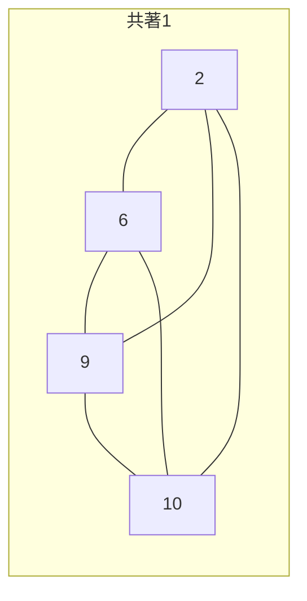

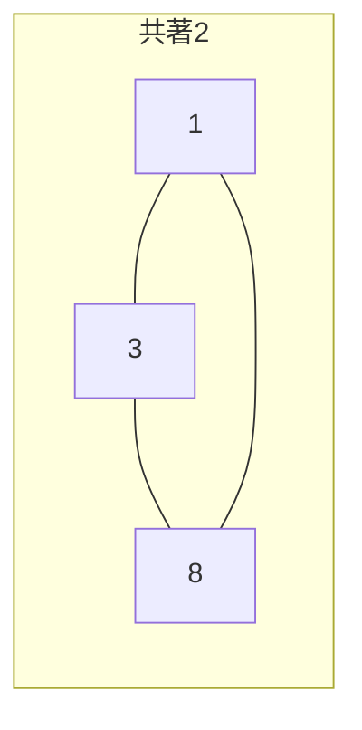

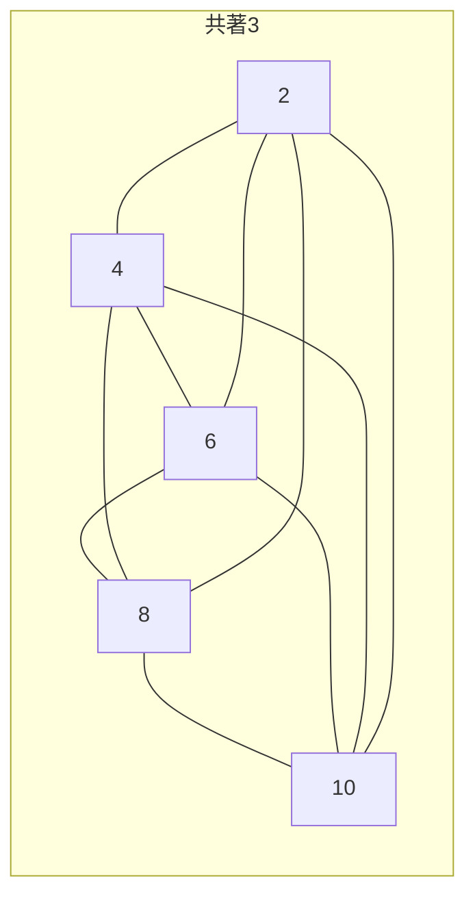

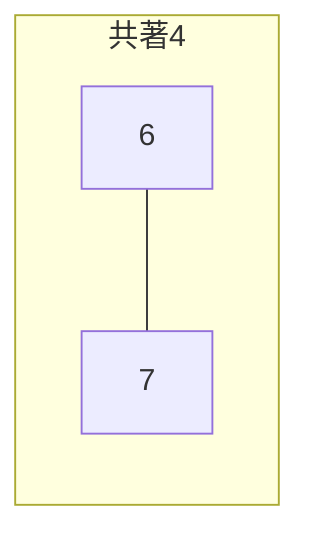


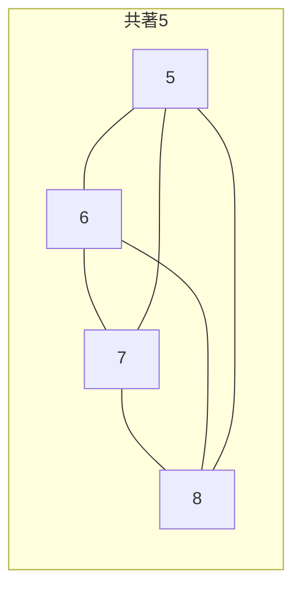

このとき、各頂点の 1 からの距離はどうか、という問題です。

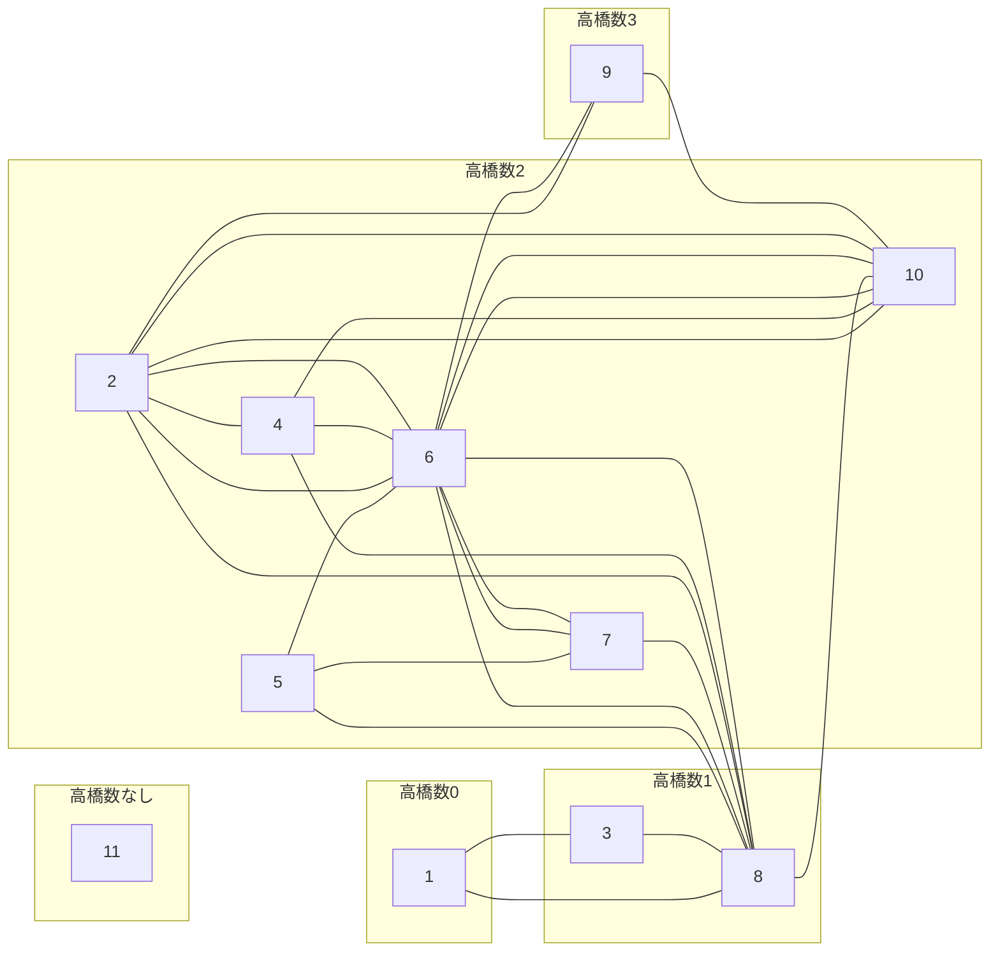

これで Dijkstra 法を使えば高橋数が求まります。

しかし辺の数が多く、ごちゃっとしています。共著者 m 人のときに、$_mC_2= m(m-1)/2$ 本の辺が現れます。制約であり得る共著者 10万人になると、もれなく TLE 確定です。


## 超頂点 (virtual node) を使う


を、頂点を増やす形で書き直してみます。

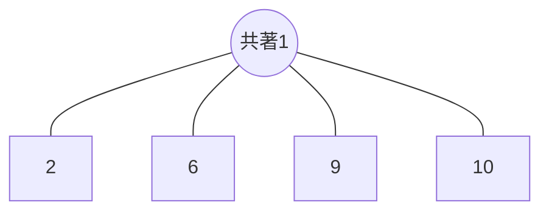

頂点 `2` と頂点 `6` の位置関係が、隣から、頂点 `共著1` を挟んで 2辺を通る場所に変わりました。距離は増えますがグラフはスッキリした形になります。

他も同様に行います。

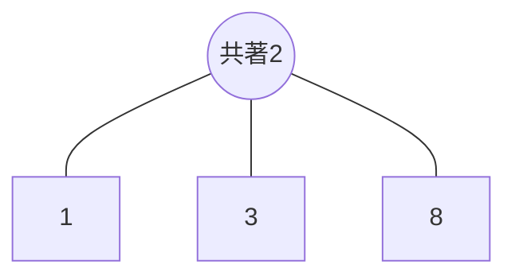

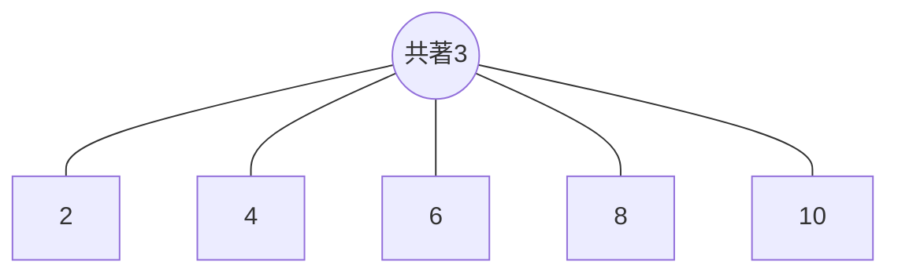

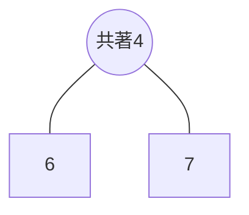

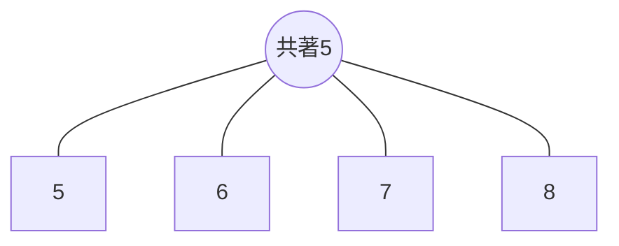

共著者 m 人のときに、辺の数が m 本に抑えられました。

すべてつなげると次のようになります。


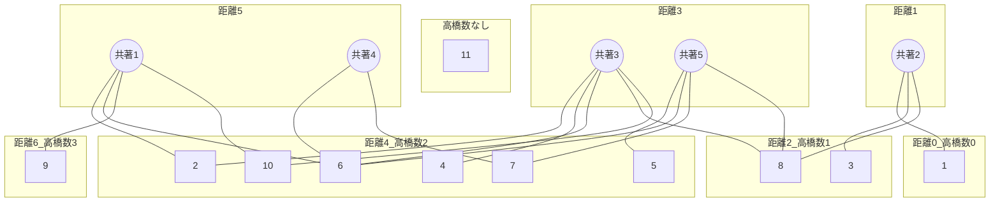

目で見ても接続関係が分かります。

超頂点が上側、元の頂点が下側に並ぶ、二部グラフのような形になります。 [^1]

[^1]: 二部グラフのような、とにごしています。二部グラフ内に、頂点11 のように接続関係がない頂点を含めて良いのか分かりません。

コード例です。頂点数 N=11、共著論文数 M=5 なら、共著論文を超頂点とした頂点数 16 の無向グラフを作ります。

```rust
let mut graph = vec![vec![]; n + m];
for i in 0..m {
    let j = n + i; // 超頂点

    input! {
        k: usize,
        r: [Usize1; k],
    }
    for x in r {
        graph[j].push(x);
        graph[x].push(j);
    }
}
```

グラフができれば、あとは [003 - Longest Circular Road（★4）](./typical90_003) と同じように Dijkstra を解くことで終了でうす。 `pathfinding` でも良いです。


# 実装例

## 超頂点 + dijkstra (01-BFS)
https://github.com/hossy3/atcoder-solutions/blob/main/atcoder/typical90/src/bin/054_bipartite_dijkstra.rs

## 超頂点 + dijkstra (pathfinding)
https://github.com/hossy3/atcoder-solutions/blob/main/atcoder/typical90/src/bin/054_bipartite_pathfinding.rs
