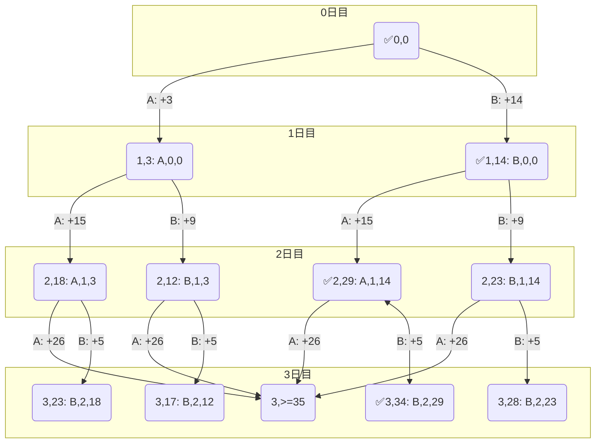
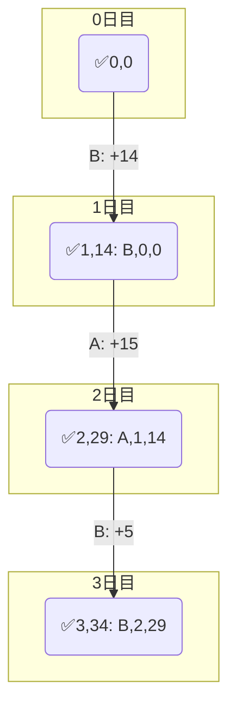

[056 \- Lucky Bag（★5）](https://atcoder.jp/contests/typical90/tasks/typical90_bd)


# アルゴリズム
ほとんど公式解説そのままです。

入力例1 を考えます。

|日|福袋A|福袋B|
|---|---|---|
|1日目|3|14|
|2日目|15|9|
|3日目|26|5|

毎日福袋 A または B のいずれか一方を選び、合計金額が 34 になる方法を調べます。

この問題は `BAB` とすると 14+15+5 = 34 ちょうどになります。


## DP で可能かの判定問題を解く

DP で毎日の (A, B) 選択結果を更新します。 3日で合計金額が 34 ちょうどになる場所を調べるなら、途中で 34 を上回る場合はその場で没にできます。

|0日目|0|
|---|---|
||✅|

|1日目|3|14|
|---|---|---|
|1日目 A|✅0+3||
|1日目 B||✅0+14|

|2日目|12|18|21|29|
|---|---|---|---|---|
|2日目 A||✅3+15||✅14+15|
|2日目 B|✅3+9||✅14+9||

|3日目|17|23|26|34|35以上|
|---|---|---|---|---|---|
|3日目 A|||||12+26<br/>18+26<br/>23+26<br/>29+26|
|3日目 B|✅12+5|✅18+5|✅21+5|✅29+5||

最終日まで調べた時に、34 に ✅ がついていれば可能、なければ不可能、というように判定問題が解けました。

毎日 2択だと日数 $n$ に対して $2^n$ のように組み合わせが爆発しそうにも思えます。しかし金額の上限が $s \le 100,000$ です。100日繰り返しても十分計算できます。

コードは次のようになります。

```rust
input! {
    n: usize,
    s: usize,
    ab: [(usize, usize); n],
}

let mut dp = vec![vec![false; s + 1]; n + 1];
dp[0][0] = true;
for i in 0..n {
    for j in 0..s {
        if !dp[i][j] {
            continue;
        }
        let (a, b) = ab[i];
        if j + a <= s {
            dp[i + 1][j + a] = true;
        }
        if j + b <= s {
            dp[i + 1][j + b] = true;
        }
    }
}

if !dp[n][s] {
    println!("Impossible");
    return;
}
```

## 手順を再生する

### 1日前の状態が到達可能かを調べる方法

3日目に合計 34円使っているなら、2日目の合計金額は 3日目で使った (A: 26, B: 5) 円のどちらかを引いた値のはずです。34-26 = 8, 34-5 = 29、`[8, 29]` が候補です。

0日目から 2日目までたどった候補は `[12, 18, 21, 29]` でした。両方を満たす 29 円に戻ります。3日目は B を選んだことになります。

これを 0日目まで繰り返せば、手順を再生できます。

|3日目|17|23|26|34|35以上|
|---|---|---|---|---|---|
|3日目|❔|❔|❔|✅||

|2日目|12|18|21|29|
|---|---|---|---|---|
|3日目 A(26)|❔|❔|❔|❔|
|3日目 B(5)|❔|❔|❔|✅34-5|

|1日目|3|14|
|---|---|---|
|2日目 A(15)|❔|✅29-15|
|2日目 B(9)|❔|❔|

|0日目|0|
|---|---|
|1日目 A(3)|❔|
|1日目 B(14)|✅14-14|

A, B 両方選べることもあります。その場合はどちらでも正解です。

コードは次のようになります。

```rust
let mut course = vec!['A'; n];
let mut j = s;
for i in (0..n).rev() {
    let (a, b) = ab[i];
    if j >= a && dp[i][j - a] {
        j -= a;
    } else {
        j -= b;
        course[i] = 'B';
    }
}
println!("{}", course.iter().join(""));
```

### 選択肢を覚えておく方法

この問題では先ほどの方法で解けましたが、問題によっては前の状態を辿りにくい場合もあります。

その場合は、状態に前回の場所を含めます。そうすると親をたどり続けることで経路を復元できます。




ここから親を辿るのは簡単です。`BAB` が答えです。




```rust
let mut dp = vec![vec![None; s + 1]; n + 1];
for i in 0..n {
    for j in 0..s {
        if dp[i][j].is_none() && !(i == 0 && j == 0) {
            continue;
        }
        let (a, b) = ab[i];
        if j + a <= s {
            dp[i + 1][j + a] = Some(('A', (i, j)));
        }
        if j + b <= s {
            dp[i + 1][j + b] = Some(('B', (i, j)));
        }
    }
}

if dp[n][s].is_none() {
    println!("Impossible");
    return;
}

let mut result = VecDeque::new();
let mut i = n;
let mut j = s;
while let Some((c, (i0, j0))) = dp[i][j] {
    result.push_front(c);
    (i, j) = (i0, j0);
}
println!("{}", result.iter().join(""));
```


# 実装例

## 到達可能かを状態として持つ
https://github.com/hossy3/atcoder-solutions/blob/main/atcoder/typical90/src/bin/056_backtrace.rs

## 到達可能かと 1つ前の経路を状態として持つ
https://github.com/hossy3/atcoder-solutions/blob/main/atcoder/typical90/src/bin/056_backtrace_2.rs

