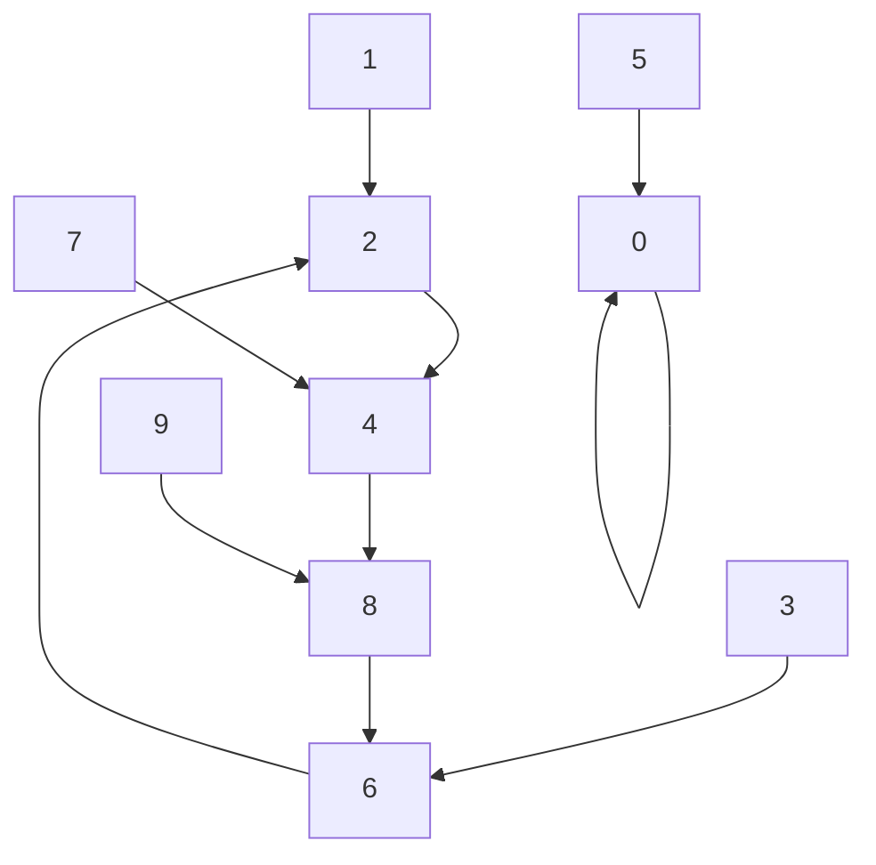

[058 \- Original Calculator（★4）](https://atcoder.jp/contests/typical90/tasks/typical90_bf)


# アルゴリズム

## そのまま解く (TLE)

$10^5$ までの数字を考えるのは難しいです。計算機が $10^1$ 未満、 1桁の数字だけ扱える場合を考えます。

1 回ボタンを押すと、x が z に変わります。

|x|y: 各桁の和|z: x+yを10で割った余り|
|---|---|---|
|0|0|0|
|1|1|2|
|2|2|4|
|3|3|6|
|4|4|8|
|5|5|0|
|6|6|2|
|7|7|4|
|8|8|6|
|9|9|8|

そのまま書くとこのようになります。

```rust
fn f(x: usize) -> usize {
    let y = x;
    (x + y) % 10
}

fn main() {
    input! {
        n: usize,
        k: usize,
    }
    let mut x = n;
    for _ in 0..k {
        x = f(x);
    }
    println!("{x}");
}
```

1回あたりの計算は簡単です。しかし、この問題の制約によると、ボタンを最大 $10^{18}$ 回押します。ボタンを押すたびに毎回次の場所を調べていると、制限時間に間に合いません。

## 周期性

先ほど表で書いた移動を、グラフでも描いてみます:



「(2 → 4 → 8 → 6) → (2 → 4 → 8 → 6) → ...」 と、4個セットの移動を繰り返しそうです。このループの中でボタンを 100回押したとしても、 25周して同じ場所に戻りますから、何も押さない場合と同じ結果です。

つまり、次のように考えられます。

* ボタンを押すたびに、その場所と何回押した時かを覚えておく (配列など)
* 以前来た場所にまた来たときには、ループと分かる
  * 周期は、今回の押した数と前回の押した数の差
  * 残りのボタンを押す数を、周期で割った余りに変更できる

`v[x]` に、値 x になったときにボタンを押す数を入れた例です。

```diff rust
+    let mut v = vec![usize::MAX; N];
+    let mut count = 0;
     let mut x = n;
+    v[x] = 0;
-    for _ in 0..k {
+    while count < k {
         x = f(x);
+        count += 1;
+        if v[x] < usize::MAX && (k - count) % (count - v[x]) == 0 {
+            break;
+        }
+        v[x] = count;
     }
```

n=1, k=123 のとき、このように動きます:

|count|x|z|v[0]|v[1]|v[2]|v[3]|v[4]|v[5]|v[6]|v[7]|v[8]|v[9]|
|---|---|---|---|---|---|---|---|---|---|---|---|---|
|0|||-1|-1|-1|-1|-1|-1|-1|-1|-1|-1|
|1|1|2|||⚡1||||||||
|2|2|4|||||⚡2||||||
|3|4|8|||||||||⚡3||
|4|8|6|||||||⚡4||||
|5|6|2|||🔍||||||||

周期 4と分かりました。このあともいろいろな方法があります。

* count=5 は count=121 と同じ場所。 k=123 に近づける。あと 2つ進めれば良い
* k = 123 を 4 で割った余りは 3。count を 4で割った余りが 3 になるまで進める

この方針なら全然問題なく間に合います。

## 各桁の数の合計

```rust
fn f(x: usize) -> usize {
    (x % 10) + ((x / 10) % 10) + ((x / 100) % 10) + ((x / 1000) % 10) + ((x / 10000) % 10)
}
```

や

```rust
fn f(x: usize) -> usize {
    (0..5).map(|k| (x / 10_usize.pow(k)) % 10).sum::<usize>()
}
```

のようにすることで求まります。


# 実装例

## 周期性
https://github.com/hossy3/atcoder-solutions/blob/main/atcoder/typical90/src/bin/058_cycle_2.rs
