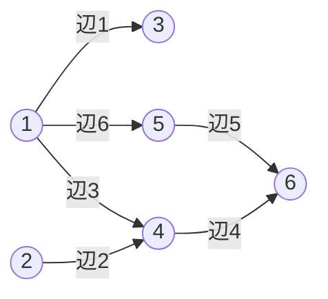
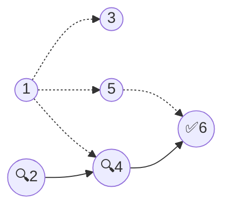
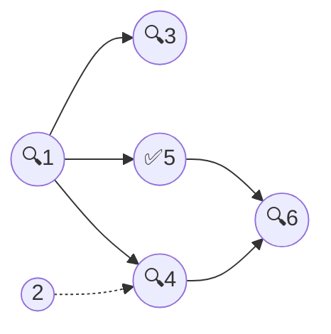
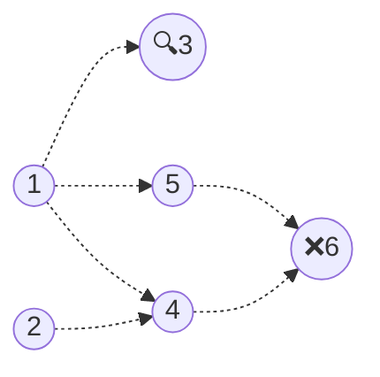

[059 \- Many Graph Queries（★7）](https://atcoder.jp/contests/typical90/tasks/typical90_bg)


# アルゴリズム

## 例題 1 を読む

例題1 を考えます。頂点 X から頂点 Y へ向かう辺があります。

|辺 i|頂点 X|頂点 Y|
|---|---|---|
|1|1|3|
|2|2|4|
|3|1|4|
|4|4|6|
|5|5|6|
|6|1|5|



このグラフに対して、頂点 X から頂点 Y に到達可能かを調べます。

|頂点 X|頂点 Y|可能？|
|---|---|---|
|2|6|✅|
|1|5|✅|
|3|6|❌|

小さな問題ではグラフを描くと辿れます。







AB の組が最大 10万個、XY の組も最大 10万個あると、けっこう大変です。


## 1つずつ調べる (TLE)

頂点2 から 頂点6 に進めるかを、(X, Y) を順に辿って考えます。

|X|Y|頂点1|頂点2|頂点3|頂点4|頂点5|頂点6|
|---|---|---|---|---|---|---|---|
||||✅|||||

頂点 2 から辿れる候補をすべて調べます。頂点 4 に辿れます。

|X|Y|頂点1|頂点2|頂点3|頂点4|頂点5|頂点6|
|---|---|---|---|---|---|---|---|
||||✅|||||
|2|4||✅||✅|||

次に、頂点 4 から辿れる候補をすべて調べます。頂点 6 に辿れます。

|🔍X|⚡Y|頂点1|頂点2|頂点3|頂点4|頂点5|頂点6|
|---|---|---|---|---|---|---|---|
||||✅|||||
|2|4||✅🔍||✅⚡|||
|4|6||✅||✅🔍||✅⚡|

よって、頂点 2 から頂点 6 にたどり着くことができます。

このようにピンポイントに調べても良いですし、すべての X, Y の組を昇順に左から順に当てはめるようにしても良いです。X にたどり着く方法がないないときは、Y に値が入っていても何もしません。

|🔍X|⚡Y|頂点1|頂点2|頂点3|頂点4|頂点5|頂点6|
|---|---|---|---|---|---|---|---|
||||✅|||||
|1|3|🔍|✅|||||
|1|4|🔍|✅|||||
|1|5|🔍|✅|||||
|2|4||✅🔍||✅⚡|||
|4|6||✅||✅🔍||✅⚡|
|5|6||✅||✅|🔍|✅|

他2つも同じように調べられます。

|🔍X|⚡Y|頂点1|頂点2|頂点3|頂点4|頂点5|頂点6|
|---|---|---|---|---|---|---|---|
|||✅||||||
|1|3|✅🔍||✅⚡||||
|1|4|✅🔍||✅|✅⚡|||
|1|5|✅🔍||✅|✅|✅⚡||
|2|4|✅|🔍|✅|✅|✅||
|4|6|✅||✅|✅🔍|✅|✅⚡|
|5|6|✅||✅|✅|✅🔍|✅⚡|

|🔍X|⚡Y|頂点1|頂点2|頂点3|頂点4|頂点5|頂点6|
|---|---|---|---|---|---|---|---|
|||||✅||||
|1|3|🔍||✅⚡||||
|1|4|🔍||✅|⚡|||
|1|5|🔍||✅||⚡||
|2|4||🔍|✅||||
|4|6|||✅|🔍||⚡|
|5|6|||✅||🔍|⚡|

コードは次の通りです。

```rust
fn f(n: usize, xy: &[(usize, usize)], (a, b): (usize, usize)) -> bool {
    let mut v = vec![false; n];
    v[a] = true;
    for &(x, y) in xy {
        v[y] |= v[x];
    }
    v[b]
}
```

この方法でだいたい間に合います。しかし残念ながら、重いケースでは時間切れになります。

## 64並列で調べる

時間切れにならないように、3回の処理を1回にまとめることはできるでしょうか。


このグラフに対して、頂点 X から頂点 Y に到達可能かを調べます。

|問題番号|頂点 X|頂点 Y|可能？|
|---|---|---|---|
|0|2|6|✅|
|1|1|5|✅|
|2|3|6|❌|

* 問題番号 0 の頂点 X (2) に、初期値 $2^0$ を足します
* 問題番号 1 の頂点 X (1) に、初期値 $2^1$ を足します
* 問題番号 2 の頂点 X (3) に、初期値 $2^2$ を足します

3つの問題を2進数で見ると、それぞれのビットが独立しています。先ほどと同じように bit or を取り続けることで、状態をまとめて調べられます。

|🔍X|⚡Y|頂点1|頂点2|頂点3|頂点4|頂点5|頂点6|
|---|---|---|---|---|---|---|---|
|||010|001|100|000|000|000|
|1|3|010🔍|001|110⚡|000|000|000|
|1|4|010🔍|001|110|010⚡|000|000|
|1|5|010🔍|001|110|010|010⚡|000|
|2|4|010|001🔍|110|011⚡|010|000|
|4|6|010|001|110|011🔍|010|011⚡|
|5|6|010|001|110|011|010🔍|011⚡|

最後に次のように調べて、答えを確認します。

* 問題番号 0 の頂点 Y (6) に、$2^0$ のビットが立っているか: yes ✅
* 問題番号 1 の頂点 Y (5) に、$2^1$ のビットが立っているか: yes ✅
* 問題番号 2 の頂点 Y (6) に、$2^2$ のビットが立っているか: no ❌

このようにして、`usize` (64bit OS では 64bit 非負整数型) を使ってまとめて最大 64 個の問い合わせに対応できます。

```rust
fn f(n: usize, xy: &[(usize, usize)], ab: &[(usize, usize)]) -> Vec<bool> {
    let mut v = vec![0usize; n];
    for (k, &(a, _)) in ab.iter().enumerate() {
        v[a] |= 1 << k;
    }
    for &(x, y) in xy {
        v[y] |= v[x];
    }

    let result: Vec<bool> = ab
        .iter()
        .enumerate()
        .map(|(k, &(_, b))| (v[b] >> k) & 1 == 1)
        .collect();
    result
}
```

元の問題を 64 個単位で切り出すには、たとえば `step_by()` します。

```rust
fn main() {
    input! {
        n: usize,
        m: usize,
        q: usize,
        mut xy: [(Usize1, Usize1); m],
        ab: [(Usize1, Usize1); q],
    }
    xy.sort();

    for i in (0..q).step_by(64) {
        let nbits = (q - i).min(64);
        let results = f(n, &xy, &ab[i..(i + nbits)]);
        for yes in results {
            println!("{}", if yes { "Yes" } else { "No" });
        }
    }
}
```


# 実装例

## 1つずつ調べる (TLE)
https://github.com/hossy3/atcoder-solutions/blob/main/atcoder/typical90/src/bin/059_per_query_tle.rs

## 64並列で調べる
https://github.com/hossy3/atcoder-solutions/blob/main/atcoder/typical90/src/bin/059_per_64_queries.rs
