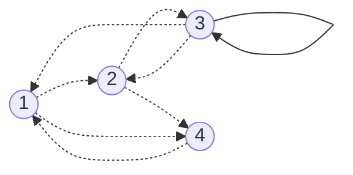
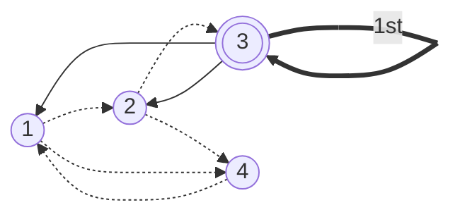
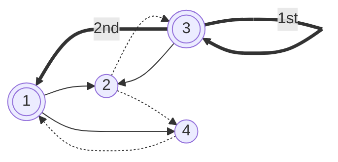
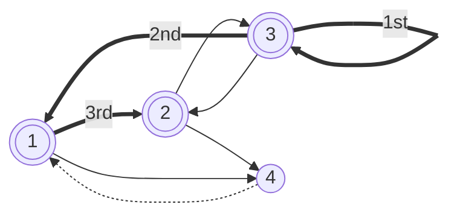
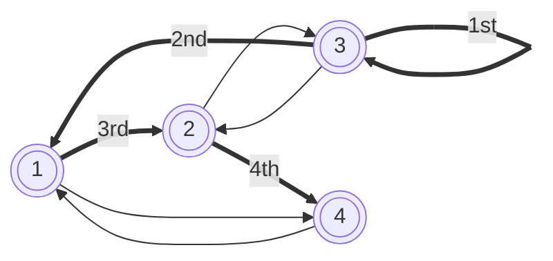

[062 \- Paint All（★6）](https://atcoder.jp/contests/typical90/tasks/typical90_bj)


# アルゴリズム

## 後ろから考える

2つのボール $A_i$, $B_i$ のいずれかが白い場合、ボール $i$ を黒くできます。この操作を繰り返し、すべての白いボールを黒くできるかを判定します。

例題1です:

|アイテム $i$|$A_i$, $B_i$|説明|
|---|---|---|
|1|3, 4|ボール3, 4のいずれかが白なら、ボール1を黒くできる|
|2|1, 3|ボール1, 3のいずれかが白なら、ボール2を黒くできる|
|3|2, 3|ボール2, 3のいずれかが白なら、ボール3を黒くできる ※|
|4|2, 1|ボール2, 1のいずれかが白なら、ボール4を黒くできる|

「※」の操作は「ボール3が白ならいつでも黒にできる」とも言い換えられます。

この問題をそのままの順番で解こうとすると難しくなります。初手ではすべてのボールが白ですので、どの操作でも行えそうです。そう思って上から順番に適用していくと、最後の操作はボール2, 1ともに黒ですので行えません。

そこで、「後ろから」行える操作を考えます。

「操作3: ボール2, 3のいずれかが白なら、ボール3を黒くできる ※」は最後に行えます。ボール3以外がすべて黒くても、ボール3を黒に変更できます。他の操作は最後には行えません。

ボール3の1つ前には、ボール2を白くしたいです。これは同様に「ボール2が白なら、ボール2を黒くできる」という条件が入っているものを探します。「操作1: ボール3, 4のいずれかが白なら、ボール1を黒くできる」「操作2: ボール1, 3のいずれかが白なら、ボール2を黒くできる」が候補になります。どちらでも良いです。

この操作を貪欲に繰り返すと、行える操作手順「の逆順」が分かります。操作手順を逆順にたどることで解が求められます。

すべての操作を適用できなければ失敗です。

逆順として説明し直すとこのようになります。

|アイテム $i$|$A_i$, $B_i$|逆順の説明|
|---|---|---|
|1|3, 4|ボール3が黒から白になれば、ボール1を黒から白にできる または<br />ボール4が黒から白になれば、ボール1を黒から白にできる|
|2|1, 3|ボール1が黒から白になれば、ボール2を黒から白にできる または<br />ボール3が黒から白になれば、ボール2を黒から白にできる|
|3|2, 3|(ボール2が黒から白になれば、ボール3を黒から白にできる または)<br />ボール3を黒から白にできる|
|4|2, 1|ボール2が黒から白になれば、ボール4を黒から白にできる または<br />ボール1が黒から白になれば、ボール4を黒から白にできる|


## 有向グラフ

先ほどの手順を有向グラフで描いてみます。











この順番 `[3, 1, 2, 4]` を逆順にした `[4, 2, 1, 3]` が正解です。


## コードを書く
たとえばこのようにコードを書きます。

最初に有向グラフを組み立てます。

```rust
    input! {
        n: usize,
        ab: [(Usize1, Usize1); n],
    }

    let mut graph = vec![vec![]; n];
    for (i, &(a, b)) in ab.iter().enumerate() {
        graph[a].push(i);
        graph[b].push(i);
    }
```


最後に実行可能な操作を、スタックやキューに追加します。

```rust
    let mut stack = vec![];
    let mut visited = vec![false; n];
    for (i, &(a, b)) in ab.iter().enumerate() {
        if i == a || i == b {
            stack.push(i);
            visited[i] = true;
        }
    }
```

次に、スタックが空でない限り、次の候補を探索してスタックに追加します。

```rust
    let mut path = vec![];
    while let Some(i) = stack.pop() {
        path.push(i);

        for &i in &graph[i] {
            if visited[i] {
                continue;
            }
            visited[i] = true;
            stack.push(i);
        }
    }
```

最後にパスを逆順 `.rev()` に辿って出力します。 パスの長さが足りなければ到達不能 `-1` を出力します。

```rust
    if path.len() == n {
        for &x in path.iter().rev() {
            println!("{}", x + 1);
        }
    } else {
        println!("-1");
    }
```


# Tips

## テスト省略

この問題は正解が複数ある場合があります。 `cargo compete test 062` で解答例と異なるとテストが通過しません。 `cargo compete submit 062` で提出しようとしてもテストが通らないと手元の事前チェックではじかれます。

[026 - Independent Set on a Tree（★4）](./typical90_026)

と同じように、解答に自信があるなら  `cargo compete submit 062 --no-test` とオプションを付けて実行します。


# 実装例

## Vec (Stack, BFS)
https://github.com/hossy3/atcoder-solutions/blob/main/atcoder/typical90/src/bin/062_stack.rs

## VecDeque (Queue, DFS)
https://github.com/hossy3/atcoder-solutions/blob/main/atcoder/typical90/src/bin/062_queue.rs
