[064 \- Uplift（★3）](https://atcoder.jp/contests/typical90/tasks/typical90_bl)


# アルゴリズム

## 地殻変動を図示

例題2 の最初の手順を図示します。

```mermaid
xychart-beta
  title "地殻変動前"
  x-axis [1, 2, 3, 4, 5, 6, 7, 8, 9, 10, 11, 12, 13, 14, 15, 16, 17, 18, 19, 20]
  y-axis "標高" -120 --> 180
  bar [-150]
  bar [61, 51, 92, -100, -89, -65, -89, -64, -74, 7, 87, -2, 51, -39, -50, 63, -23, 36, 74, 37]
```

```mermaid
xychart-beta
  title "地殻変動 1回目: 区画 [2..2] を -45 する"
  x-axis [1, 2, 3, 4, 5, 6, 7, 8, 9, 10, 11, 12, 13, 14, 15, 16, 17, 18, 19, 20]
  y-axis "標高" -120 --> 180
  bar [-150, 51]
  bar [61, 6, 92, -100, -89, -65, -89, -64, -74, 7, 87, -2, 51, -39, -50, 63, -23, 36, 74, 37]
```

```mermaid
xychart-beta
  title "地殻変動 2回目: 区画 [6..19] を +89 する"
  x-axis [1, 2, 3, 4, 5, 6, 7, 8, 9, 10, 11, 12, 13, 14, 15, 16, 17, 18, 19, 20]
  y-axis "標高" -120 --> 180
  bar [-150]
  bar [61, 6, 92, -100, -89, 17, -7, 18, 8, 89, 169, 80, 133, 43, 32, 145, 59, 118, 156, 37]
  bar [-150, -150, -150, -150, -150, -31, -31, -31, -31, -31, -31, -31, -31, -31, -31, -31, -31, -31, -31]
```

```mermaid
xychart-beta
  title "地殻変動 3回目: 区画 [2..9] を +36 する"
  x-axis [1, 2, 3, 4, 5, 6, 7, 8, 9, 10, 11, 12, 13, 14, 15, 16, 17, 18, 19, 20]
  y-axis "標高" -120 --> 180
  bar [-150]
  bar [61, 42, 128, -64, -53, 53, 29, 54, 44, 89, 169, 80, 133, 43, 32, 145, 59, 118, 156, 37]
  bar [-150, -84, -84, -84, -84, -84, -84, -84, -84]
```









## 不便さの定義

不便さ 𝑆 は、隣接する標高の差の絶対値の総和です。

$$
S = \sum_{i=1}^{N-1} |E_{i+1} - E_i|
$$

最初の不便さを求めるコードです。

```rust
let mut diffs: Vec<_> = (0..(n - 1)).map(|i| a[i + 1] - a[i]).collect();
let mut score: i64 = diffs.iter().map(|x| x.abs()).sum();
```

標高を変更するたびに、不便さを再計算する必要があります。しかし計算を素朴に行うと、各クエリで $𝑂(𝑁)$ の処理が必要になります。クエリが $Q$ 個あると、最悪
$𝑂(𝑁Q)$ の計算時間となり、TLE します。


## 階差を用いた効率化

標高差 $𝐸_{i+1}-E_i$ を管理すれば、区間変更の影響を $𝑂(1)$ で計算できます。

たとえば、区画 `[2..9]` を +36 するとき、次の2つの標高差だけに影響が出ます。

* 区間1 ～ 区間2 （右だけ増加）
* 区間9 ～ 区間10 （左だけ増加）

したがって、不便さを前回の値から直接更新できます。

標高 $E_i$ の変更をそのまま扱うと、次の表のようになっていました。

||1|2|3|4|5|6|7|8|9|10|11|12|13|14|15|16|17|18|19|20|
|---|---|---|---|---|---|---|---|---|---|---|---|---|---|---|---|---|---|---|---|---|
|最初|61|51|92|-100|-89|-65|-89|-64|-74|7|87|-2|51|-39|-50|63|-23|36|74|37|
|1回目|61|⚡6|92|-100|-89|-65|-89|-64|-74|7|87|-2|51|-39|-50|63|-23|36|74|37|
|2回目|61|6|92|-100|-89|⚡17|⚡-7|⚡18|⚡8|⚡89|⚡169|⚡80|⚡133|⚡43|⚡32|⚡145|⚡59|⚡118|⚡156|37|
|3回目|61|⚡42|⚡128|⚡-64|⚡-53|⚡53|⚡29|⚡54|⚡44|89|169|80|133|43|32|145|59|118|156|37|

標高の差 $E_{i+1}-E_i$ を扱うと、次の表のようになります。

||1|2|3|4|5|6|7|8|9|10|11|12|13|14|15|16|17|18|19|不便さ|
|---|---|---|---|---|---|---|---|---|---|---|---|---|---|---|---|---|---|---|---|---|
|最初|-10|41|-192|11|24|-24|25|-10|81|80|-89|53|-90|-11|113|-86|59|38|-37|(1074)|
|1回目|⚡-55|⚡86|-192|11|24|-24|25|-10|81|80|-89|53|-90|-11|113|-86|59|38|-37|(1164)|
|2回目|-55|86|-192|11|⚡106|-24|25|-10|81|80|-89|53|-90|-11|113|-86|59|38|⚡-119|(1328)|
|3回目|⚡-19|86|-192|11|106|-24|25|-10|⚡45|80|-89|53|-90|-11|113|-86|59|38|-119|(1256)|

地殻変動後の不便さは、直前の不便さと ⚡ の前後の値から求まります。

3回目の変更は「-55 → -19, 81 → 45」と変わっています。不便さはどちらも標高差が縮まる方向ですので、(55-19) + (81-45) = 72 だけ前回より小さくなります。1328 - 1256 = 72 です。

この考え方を Rust で実装すると、次のようになります。

```rust
for (l, r, v) in lrv {
    if l > 0 {  // 左端でない場合
        score -= diffs[l - 1].abs();  // 変更前の不便さを減算
        diffs[l - 1] += v;  // 変更を適用
        score += diffs[l - 1].abs();  // 変更後の不便さを加算
    }
    if r < n - 1 {  // 右端でない場合
        score -= diffs[r].abs();
        diffs[r] -= v;
        score += diffs[r].abs();
    }
    println!("{score}");
}
```

こちらで解けました。

## セグメント木で合計を求める

階差と不便さの2か所を更新するのは少し手間がかかります。

一応、セグメント木にスコアの更新をお任せすることもできます。

```rust
let mut segtree = Segtree::<AbsAdd<_>>::from(diffs);

for (l, r, v) in lrv {
    if l > 0 {  // 左端でない場合
        segtree.set(l - 1, segtree.get(l - 1) + v);  // 変更を適用
    }
    if r < n - 1 {  // 右端でない場合
        segtree.set(r, segtree.get(r) - v);
    }
    let score = segtree.all_prod();  // 不便さを更新
    println!("{score}");
}
```

一応できますが、かえって複雑にも思います。


# 実装例

## 階差数列 + 前回との差分
https://github.com/hossy3/atcoder-solutions/blob/main/atcoder/typical90/src/bin/064_diff.rs

## 階差数列 + セグメント木
https://github.com/hossy3/atcoder-solutions/blob/main/atcoder/typical90/src/bin/064_segtree.rs

